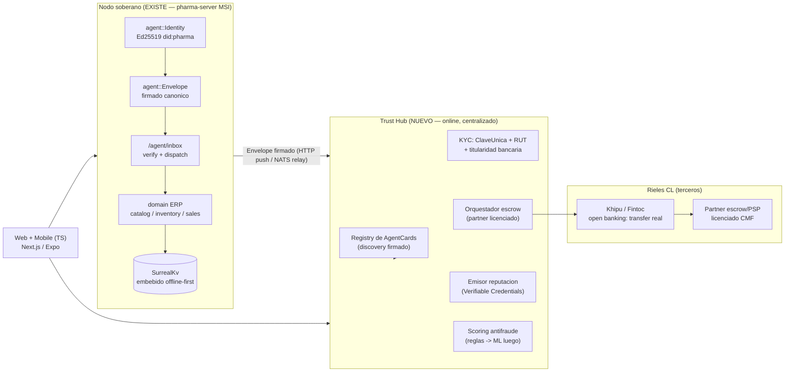

# Plan maestro — Marketplace de confianza basado en identidad verificable

> **Documento estratégico, no scaffolding.** Entrega análisis fundador/VC/arquitecto-jefe
> y arquitectura objetivo. La implementación técnica del Hub/escrow es un plan separado
> posterior, una vez validada la estrategia aquí. Consistente con
> [`docs/ecosystem-roadmap.md`](./ecosystem-roadmap.md) (esto es la **Fase 12** de ese
> roadmap). Última edición: 2026-05-16.

---

## 0. Tesis (por qué este documento reordena la idea)

El usuario pidió un marketplace antifraude con identidad criptográfica y reputación
portable para Chile → LATAM. Tras explorar el repo, la conclusión que reordena toda la
estrategia es esta:

> **El activo diferencial ya está construido y no es el marketplace — es el protocolo
> de comercio federado firmado, anclado a un nodo ERP que ya se vende solo.**

Esto no es opinión: es evidencia en código del propio repositorio.

| Activo | Ruta real | Qué prueba |
|---|---|---|
| Identidad de nodo Ed25519 | [`crates/agent/src/identity.rs`](../crates/agent/src/identity.rs) | Keypair generada en install, persistida (seed hex; `0600` best-effort Unix, ACL del data dir en Windows/LocalSystem), DID estable `did:pharma:<bs58(pubkey)>`, `load_or_init` idempotente, `verify_with_did` (tests: roundtrip, sign/verify, tamper falla, idempotencia). |
| Sobre firmado canónico | [`crates/agent/src/envelope.rs`](../crates/agent/src/envelope.rs) · [`canonical.rs`](../crates/agent/src/canonical.rs) | JSON canónico → firma Ed25519; `verify()` rechaza body manipulado y `from` falsificado. |
| AgentCard discovery | [`crates/agent/src/card.rs`](../crates/agent/src/card.rs) | Tarjeta auto-firmada (name, kind, region, endpoint); se invalida si se altera el endpoint. |
| Transporte nodo-a-nodo real | [`crates/api/src/v1/agent.rs`](../crates/api/src/v1/agent.rs) | `/agent/inbox`: verifica firma → addressing check → despacha `ping`/`catalog.lookup`/`quote.request`/`po.create` → responde con sobre firmado. **`po_create` re-cotiza el precio canónico server-side y NO confía en el `unit_price` del comprador** (líneas 404-526; `price_adjusted:true` si divergió). Auth = firma del sobre, **no** JWT ni tenant scope. |
| Reputación local-only + opt-in | [`migrations/0008_agent.surql`](../migrations/0008_agent.surql) · [`0009_agent_order.surql`](../migrations/0009_agent_order.surql) | Grafo `agent_interaction` por nodo (jamás centralizado); `agent_order` inbound; gate por tenant `admin_setting.federation_enabled == "true"` antes de exponer precio/stock (`resolve_federation_tenant`, agent.rs:216-285). |
| ERP vendible hoy | [`migrations/0001_init.surql`](../migrations/0001_init.surql) · `CLAUDE.md` | Multi-tenant estricto, SurrealKv embebido, MSI on-prem, release `v0.1.5` publicado. Valor **single-player** antes de que exista la red. |

Por qué esto importa estratégicamente: los marketplaces mueren en el cold-start porque
parten sin oferta, sin demanda y sin producto. Aquí ya existe (a) un ERP/POS on-prem
vendible que da valor single-player, (b) un protocolo firmado de órdenes inter-nodo,
(c) un cliente real (Tu Farmacia, Coquimbo — repo separado `build-and-deploy-webdev-asap`)
como nodo #1 / design partner. No se está "construyendo un Yapo mejor". Se está
**construyendo el riel de confianza y liquidación**. El resto del documento es
brutalmente honesto, sin "depende", con UNA estrategia elegida y defendida.

---

## 1. Validación real de mercado

### 1.1 Tamaños (órdenes de magnitud — estimaciones de memo, no cifras auditadas)

- **e-commerce Chile**: ~US$15–20B/año. El segmento C2C/clasificados (Facebook
  Marketplace + Yapo + C2C de MercadoLibre) tiene GMV difuso porque **el grueso del
  cierre ocurre fuera de plataforma** (WhatsApp + transferencia). Ese "fuera de
  plataforma" es exactamente la grieta que explota el fraude y donde no hay incumbente.
- **Retail farmacia Chile**: ~US$4–5B/año, **oligopolio brutal**: Cruz Verde/SB,
  Salcobrand, Ahumada concentran ~90%+. El independiente es minoría estructuralmente
  decreciente, price-taker de margen fino. La distribución mayorista (droguerías/
  distribuidoras: Socofar, Difarma, regionales) es el lado "vendedor" natural del wedge
  B2B: pocos actores, alto ticket, recurrencia garantizada.
- **TAM / SAM / SOM** (para la estrategia recomendada §2 — B2B SMB retail, beachhead
  farmacia independiente):
  - **TAM**: comercio mayorista→minorista SMB LATAM (cualquier vertical que reordena a
    distribuidor). Decenas de US$B de GMV intermediable.
  - **SAM**: SMB retail Chile que hoy reordena por WhatsApp + transferencia a ciegas
    (farmacia indep., ferretería, minimarket, distribuidoras de abarrotes). Miles de
    negocios; GMV anual de varios US$B.
  - **SOM 24 meses**: 20–60 nodos activos región Coquimbo/La Serena + 2ª región. GMV
    inter-nodo modesto pero alto ticket y recurrente, **más** ARR del ERP SaaS (que
    existe hoy). El SOM no depende de ganar el cold-start de consumidor.

### 1.2 El problema real (y dónde NO está)

El fraude de "depósito falso / comprobante de transferencia trucado" es **la** estafa
chilena de marketplace, y ocurre precisamente donde no hay escrow: Facebook Marketplace
+ WhatsApp + transferencia irreversible. Consecuencias para el diseño:

- El problema **no** es "falta un marketplace con reputación". Es que **el cierre de
  trato ocurre fuera de toda plataforma**, en el canal sin escrow. Construir otro
  listado no toca el problema.
- MercadoLibre **ya resolvió** buena parte de la confianza on-platform (MercadoPago +
  ML Protegido + Mercado Envíos). Atacarlos de frente en C2C es suicida.
- La palanca real en Chile no es "reputación" sino **verificación de transferencia
  real**: Khipu / Fintoc / open banking confirman que la plata se movió y que el
  titular de la cuenta = la identidad KYC. Eso mata el comprobante falso de raíz.
  Reputación es el complemento, no el núcleo. Este es el insight central del documento.

### 1.3 Comportamiento cultural CL (lo que importa para el diseño)

- RUT universal; **ClaveÚnica** masiva (OIDC estatal usable como ancla de identidad);
  CuentaRUT casi universal; transferencia electrónica como default e **irreversible**
  (sin chargeback — bueno para escrow del vendedor, devastador para la víctima del
  comprobante falso).
- **WhatsApp es el canal de cierre** tanto en C2C como en B2B (el vendedor de la
  distribuidora literalmente vive en WhatsApp). Cualquier GTM que ignore WhatsApp
  fracasa — no se reemplaza el canal, se le inyecta confianza por debajo.
- Lo que la gente **odia** de Yapo/Facebook: fantasmas, "te deposité" falso, cero
  recurso, cero identidad. Lo que **ama**: gratis y líquido. Corolario de diseño:
  no se compite contra "gratis y líquido" siendo otro listado; se compite agregando
  la capa que ellos no tienen — confianza verificable en la transacción.

### 1.4 Competencia, barreras, moat (sin maquillaje)

| Competidor | Fortaleza | Vulnerabilidad explotable |
|---|---|---|
| Facebook Marketplace | Gratis, liquidez infinita, distribución Meta | Cero capa transaccional, cero identidad, cero recurso → el fraude vive ahí |
| MercadoLibre | Confianza on-platform resuelta, logística | Fees que vendedores odian; débil en off-platform y en reposición B2B |
| Yapo | Marca clasificados | Sin capa transaccional; en declive vs Facebook |
| WhatsApp + transferencia | Es el canal real de cierre B2B/C2C | No es producto: nadie es dueño de la confianza ahí |

**Moat real (tipo Stripe/infra, NO tipo Yapo/listados):**

1. **Lock-in de datos ERP**: cuando el negocio corre inventario+POS en su nodo
   (`pharma-server` MSI on-prem, ya vendible), el costo de cambio es enorme. El listado
   se copia en una tarde; el sistema operativo del negocio no.
2. **Grafo de reputación portable y firmado**: más valioso cuantos más nodos; no se
   replica copiando la UI porque está anclado a transacciones firmadas reales.
3. **El protocolo como riel default de reorden B2B inter-nodo** (`po.create` firmado,
   precio canónico server-side — ya implementado en agent.rs).

Honestidad sobre network effects: los efectos de red **clásicos de marketplace**
(comprador atrae vendedor) son **débiles** aquí — Facebook ya los posee. El efecto de
red que sí defiende es el del **protocolo + identidad + lock-in ERP**, no el de los
listados. Confundir ambos es el primer error fatal.

---

## 2. Estrategia de entrada — comparación honesta y elección

| Estrategia | Dificultad | Liquidez / cold-start | CAC | Monetización | Veredicto |
|---|---|---|---|---|---|
| Marketplace general C2C | Brutal | Imposible vs Facebook | Alto (ads) | Débil (ads) | **NO** |
| Capa de confianza/escrow sobre Facebook/WhatsApp (C2C alto ticket) | Alta | Media (no construye oferta) | Medio | Fee escrow | Fase 3, no v1 |
| **B2B vertical: farmacia indep. ↔ droguería/distribuidor sobre el protocolo existente** | **Media (núcleo ya hecho)** | **Resuelto: ERP da valor single-player; pocos actores para liquidez** | **Bajo (producto vendido, no ads)** | **Fuerte (ERP SaaS + take rate + escrow)** | **ELEGIDA** |
| B2B horizontal multi-vertical desde día 1 | Alta | Disperso | Medio | Fuerte pero diluido | Fase expansión |

**Estrategia recomendada (decidida, no "depende"):**

> Marketplace B2B vertical de **abastecimiento**, beachhead en farmacia independiente
> (comprador) ↔ droguería/distribuidor (vendedor), construido como capa de
> **federación + confianza + escrow** sobre el protocolo `agent` ya existente, con el
> ERP/POS on-prem como **anzuelo de adquisición y ancla de identidad**. **Densidad
> geográfica primero** (Coquimbo/La Serena), luego expansión horizontal a SMB retail
> adyacente reusando idéntico nodo+protocolo.

**Por qué gana, punto por punto:**

- *Cold-start resuelto*: el nodo vale solo antes de la red (patrón
  single-player→multiplayer tipo Figma/Superhuman) — y el single-player **ya está
  construido y se vende** (MSI v0.1.5).
- *CAC bajo*: es un producto vendido con soporte, no captación por ads.
- *AOV alto y recurrente*: reposición farmacéutica es semanal/mensual, predecible.
- *Liquidez alcanzable en una región*: una distribuidora abastece a decenas de
  farmacias → un solo vendedor anclado genera liquidez local inmediata.
- *Monetización en tres capas con lock-in* (§3).

**La trampa a evitar (y el riesgo #1 de este proyecto, ver §9):** que el fundador
construya el protocolo federado elegante en vez del producto aburrido —escrow +
identidad verificada + reorden— que el mercado paga. La cripto es plomería; **nunca**
un feature de cara al cliente. El cliente compra "no me estafan y reordeno fácil", no
"DID Ed25519".

---

## 3. Modelo de negocio

Tres capas, ordenadas de menor a mayor defensibilidad:

1. **ERP/POS SaaS on-prem (licencia + mantención).** Ya vendible (MSI v0.1.5). COGS ≈ 0
   (on-prem, hardware del cliente), margen altísimo, cash-flow temprano. **Es el anzuelo
   y el lock-in.** Tier por nº de cajas/usuarios concurrentes. Esto financia el burn →
   bootstrap viable, ruta de menor dilución.
2. **Take rate sobre GMV inter-nodo escrowed.** Fee % sobre órdenes `po.create`
   liquidadas vía escrow. Margen alto, escala con la red — **pero requiere cientos de
   nodos para ser material**. Es el upside, no el sostén inicial. No proyectar este
   ingreso como base del runway: es la palanca, no el piso.
3. **Identity / verified-settlement as a service.** API de "verificación de
   transferencia real + identidad KYC + score de riesgo de contraparte"
   (anti-comprobante-falso) vendida a terceros: otros marketplaces, clasificados,
   fintechs, cobranza. **Esto es lo que genera moat y opcionalidad unicornio** (§10).

**Reglas de diseño del modelo:**

- **No depender de ads.** La economía es SaaS + take rate + API, no atención. Esto
  evita la carrera a cero de los clasificados.
- **Lock-in** = datos ERP (operación diaria del negocio) + reputación portable (capital
  social que el usuario no quiere perder).
- **No custodiar fondos directamente.** El escrow se orquesta vía partner licenciado
  (PSP/entidad CMF) + Khipu/Fintoc; el negocio cobra fee de **orquestación**, no es
  entidad de depósito. Decisión arquitectónica que evita el muro regulatorio (§9-3).
- Corto plazo: el dinero viene del ERP SaaS. Largo plazo: el moat viene del riel de
  identidad/liquidación. No confundir cuál paga las cuentas hoy.

---

## 4. Arquitectura técnica (decisiones razonadas)

### 4.1 Forma del sistema — qué se reusa vs qué es nuevo

Lectura del diagrama: **el nodo no se reescribe** — se generaliza el protocolo
(`crates/agent/*` ya tiene identidad, sobre, card, transporte) y se expone más. Lo
nuevo es el **Hub** (donde viven dinero, identidad, discovery, disputas) y los clientes.
La federación se mantiene por debajo (soberanía de datos + historia de
descentralización futura creíble), pero **v1 NO es una malla sin líder** — esa es la
forma garantizada de no conseguir nunca liquidez.

### 4.2 Decisiones con su porqué (no listas genéricas)

- **Rust para nodo + protocolo + núcleo del Hub.** El Hub importa `crates/agent`
  *verbatim* (mismo `Envelope`/`canonical`/`Identity` de identity.rs/envelope.rs) →
  **cero divergencia de verificación de firma** entre nodo y Hub. Una sola
  implementación de canonicalización = una sola superficie de bug criptográfico.
  Frontend web/mobile en **TS** (Next.js + Expo/React Native) por velocidad de
  iteración y mercado de contratación. **No Go**: no hay razón para un tercer lenguaje;
  añade superficie sin beneficio.
- **SurrealKv embebido en el nodo (mantener) · Postgres administrado en el Hub.**
  Offline-first del nodo es valor real ya construido y argumento de venta on-prem
  (CLAUDE.md: POS <50ms p99, sin red en hot path). Pero el Hub es online,
  money-adjacent, necesita madurez operacional, analítica y queries de fraude →
  Postgres administrado (Neon/RDS) + object storage para payloads/blobs. No correr
  SurrealDB como primario del Hub a escala (herramienta equivocada para ese trabajo).
- **Sin CRDTs.** El modelo es tenant-owned source-of-truth, sin multi-writer
  concurrente por registro. El diseño outbox + LWW ya descrito en
  `docs/ecosystem-roadmap.md` §2 (Fase 10) basta y es mucho más simple. CRDT =
  complejidad innecesaria → se corta explícitamente. Cortar complejidad es una
  decisión, no una omisión.
- **Monolito modular, no microservicios.** El nodo ya es monolito modular de crates; el
  Hub igual. Event-driven **solo** donde se gana el sueldo: máquina de estados de
  escrow/pago y scoring de fraude como workers async sobre cola durable. **NATS** (ya
  en deps del workspace, sin uso real — confirmado en CLAUDE.md) se activa como relay/
  cola cuando la escala de federación lo exija, **no antes**.
- **Federación vs centralizado → híbrido razonado.** Hub centralizado desde día 1
  (confianza, escrow, KYC, discovery, disputa); protocolo federado por debajo
  (soberanía + descentralizable creíble luego, `did:pharma`→`did:trade`). No se
  despacha malla leaderless en v1: la descentralización es una propiedad que se
  *conserva*, no un feature que se *vende* en v1.

---

## 5. Identidad y confianza (aterrizado a Chile)

- **Identidad raíz con 3 anclas independientes:**
  1. **ClaveÚnica** (OIDC estatal) — prueba de persona real ante el Estado.
  2. **Validación RUT** — identificador nacional único.
  3. **Titularidad bancaria vía Fintoc/Khipu** — nombre del titular de la cuenta =
     nombre KYC.
  Tres anclas → fuerte anti-sybil **y** anti-comprobante-falso en un solo mecanismo
  (el mismo dato que prueba identidad prueba que la transferencia es real).
- **Anti-sybil:** 1 RUT → 1 identidad raíz. Se almacena solo **HMAC del RUT** (nunca
  plaintext — Ley de Protección de Datos CL). Múltiples "tiendas" cuelgan de la raíz y
  la reputación **consolida hacia la raíz** → no se escapa de mala reputación creando
  cuenta nueva. Costo de crear identidad = 1 cuenta bancaria verificada + 1 ClaveÚnica
  (+ liveness de cédula para tiers altos). El costo marginal de un sybil deja de ser
  cero.
- **Reputación portable:** Verifiable Credentials emitidas por el Hub, ancladas al DID
  del nodo (hoy `did:pharma:` en `identity.rs`; generalizar a `did:trade:`). Función de
  **transacciones escrowed completadas** (no reviews auto-reportadas) → caro de
  falsificar porque cada punto de reputación costó una transacción real con dinero real.
  Semilla ya existe: `agent_interaction` en `migrations/0008_agent.surql` (grafo
  local-only por nodo). Cara pública **pseudónima** (handle + score + badges); RUT
  jamás expuesto.
- **Escrow como mecánica que mata el fraude:** fondos en partner licenciado; liberación
  contra confirmación de entrega; Khipu/Fintoc verifica transferencia real y titular.
  Esto elimina el comprobante falso (estafa #1 CL) — no por reputación, por
  verificación de hechos.
- **Chargebacks:** transferencia CL es irreversible (sin chargeback) → ventaja para el
  vendedor en escrow; empujar alto valor a escrow-por-transferencia-verificada. Vía
  tarjeta (Webpay/MercadoPago) sí hay chargeback → reserva de garantía + tiering de
  vendedor por historial.
- **Detección de estafadores:** features de grafo sobre `agent_interaction` (semilla ya
  en repo), reglas de velocidad, device/IP fingerprint, **mismatch nombre-titular vs
  KYC** (Fintoc entrega el titular), patrón clásico nueva-cuenta + alto-valor +
  urgencia. **Reglas primero; ML después** (ML día 1 se corta — es over-engineering sin
  datos).
- **Privacidad/datos:** nueva Ley de Protección de Datos CL (régimen tipo GDPR +
  Agencia). Minimización: nunca PII cruda al público; RUT hasheado; datos sensibles del
  ERP (PII paciente, recetas, ventas) **nunca** salen del nodo sin opt-in explícito por
  tenant — decisión ya *locked* en `docs/ecosystem-roadmap.md` §4 y enforced en código
  (`resolve_federation_tenant`, agent.rs:216-285, gate `federation_enabled`).

---

## 6. Go-to-market Chile (hiper-realista, Coquimbo/La Serena)

- **No cold-start de consumidor. Cold-start B2B desde el activo.** Tu Farmacia
  (Coquimbo, repo `build-and-deploy-webdev-asap`) = nodo #1 / design partner. Reclutar
  **físicamente** 10–20 farmacias independientes de Coquimbo/La Serena + las 2–3
  droguerías/distribuidoras que ya las abastecen. Densidad geográfica primero =
  liquidez + confianza por proximidad + logística simple.
- **Pitch (literal):** *"Deja de pagarle a la distribuidora con transferencia a ciegas
  y rezar. Pedido firmado, precio garantizado server-side, pago en escrow, historial de
  cumplimiento."* Se vende el ERP/POS (MSI ya listo) como on-ramp; el marketplace/
  federación es el upsell una vez el negocio ya vive en el nodo.
- **Growth loop:** cada farmacia-nodo le pide a su distribuidor unirse para recibir POs
  firmadas (`po.create`) → el distribuidor entra → el distribuidor empuja a sus otras
  farmacias-cliente a poner nodos para mandarle órdenes limpias → **la oferta arrastra
  la demanda**. Lock-in ERP + prueba social "tu distribuidor ya está" cierra el loop.
  Esto es un loop de oferta-empuja-demanda, no el loop débil de marketplace genérico.
- **Canal:** WhatsApp (donde vive el B2B chileno) + venta presencial regional +
  soporte. **TikTok / loops de consumidor = distracción Fase 3+**, no ahora — decir
  esto explícitamente evita malgastar el primer año en growth de vanidad.

---

## 7. Roadmap 24 meses (con qué NO construir)

| Ventana | Foco | NO construir (explícito) |
|---|---|---|
| **M0–3** | Federación MVP sobre lo existente: generalizar topics, Hub mínimo (registry de `AgentCard` firmadas + KPIs + discovery), onboard Tu Farmacia + 3–5 farmacias Coquimbo + 1 distribuidora | app consumidor, escrow, ML, mobile, CRDTs, multi-vertical |
| **M3–6** | Escrow v1 + transferencia verificada: Khipu/Fintoc + partner licenciado; matar comprobante falso; reputación v1 desde órdenes B2B escrowed; **disputa manual (humanos)** | disputa automática, multi-vertical, federación a no-confiables |
| **M6–12** | PMF en B2B farmacia regional. Meta: 20–40 nodos activos, GMV inter-nodo recurrente, ingreso take-rate + ERP SaaS. Iniciar 2ª región | expansión horizontal todavía |
| **M12–18** | Expansión horizontal de nodos: mismo nodo+protocolo a SMB retail adyacente (ferretería, minimarket, abarrotes). Lanzar identity/verified-settlement API como producto | — |
| **M18–24** | **Gate de decisión**: piloto capa de confianza consumidor en C2C alto ticket **o** doblar apuesta B2B + levantar capital | compromiso ciego sin datos del gate |

**Ignorar siempre que no pague:** blockchain/token, malla leaderless en v1, ML
antifraude temprano, app móvil antes de PMF, multi-país antes de un país sólido. La
disciplina de NO construir es la mitad del roadmap.

---

## 8. Análisis financiero (órdenes de magnitud, honesto)

- **Infra NO es la restricción.** Nodos = hardware del cliente (on-prem, COGS ≈ 0).
  Hub <100 nodos ≈ US$300–1.500/mes (Postgres administrado + servicio Rust chico +
  object storage). La nube no es el problema.
- **Centros de costo reales:**
  1. Legal/compliance — partner escrow, vendor KYC, abogado datos + fintech ≈
     US$30–80k setup + ongoing.
  2. Por-transacción Fintoc/Khipu + KYC ≈ US$0,3–1 / verificación.
  3. **Ops humanas de disputa/fraude** — el OPEX real de un marketplace de confianza es
     **gente**, no servidores. Subestimar esto mata márgenes.
  4. Sueldos: fundador + 1–2 eng.
- **Burn realista:** 2–3 personas, ~US$15–35k/mes all-in. Runway 18–24m ≈
  **US$300–700k** pre-seed/seed — **o bootstrap** sobre licencias ERP + consultoría
  (el MSI es vendible hoy; ruta de menor dilución y mayor opcionalidad).
- **Escenarios:**
  - *Conservador*: ERP SaaS sostiene, take rate marginal → negocio rentable chico
    (lifestyle/PE).
  - *Realista*: PMF B2B regional, take rate creciente, break-even ERP+fee ~M18–24.
  - *Agresivo*: la API de verified-settlement despega como producto separado (§10).
- **Métricas que importan:** nodos activos, GMV inter-nodo, take rate, **tasa de fraude
  en txn escrowed (north-star de confianza)**, retención de nodo, reorder rate, CAC
  payback (bajo por ser producto vendido). El ERP SaaS puede ser cash-flow positivo
  temprano; la rentabilidad del take-rate es **tardía** (cientos de nodos) — no mentirse
  con esto.

---

## 9. Riesgos existenciales (sin maquillaje)

1. **El fundador construye el protocolo elegante en vez del producto que pagan.** El
   propio código muestra el riesgo: hay enamoramiento de federación/cripto
   (`crates/agent/*` está pulido; el escrow/KYC que el mercado paga no existe aún).
   Esto mata la startup incluso con tecnología impecable. *Mitigación:* roadmap §7
   prohíbe explícitamente construir protocolo antes que escrow.
2. **Oligopsonio farmacéutico.** 3 cadenas dominan retail; pocos distribuidores la
   oferta; el independiente es price-taker de margen fino y puede no pagar SaaS; el
   segmento se contrae. *Mitigación:* el beachhead es **prueba de protocolo, no el
   mercado final** (§10). Honestidad: el techo *vertical-pharma* es bajo — el valor
   está en generalizar, no en farmacia.
3. **Muro regulatorio de fondos (CMF/UAF/Ley Fintech 21.521).** Tocar plata = entidad
   regulada. *Mitigación arquitectónica:* **no custodiar** — orquestar vía partner
   licenciado. Si se hace DIY, hunde el barco. Es decisión de arquitectura, no de
   producto.
4. **Fragilidad reputacional.** Todo el value prop es "seguro". Una estafa viral que
   pasa el filtro destruye la marca permanentemente. *Mitigación:* tiering conservador,
   límites por confianza, disputa humana temprana, comunicación proactiva de incidentes.
5. **Incumbente copia el feature.** Facebook/ML agregan verificación de transferencia y
   borran la tesis consumidor. *Mitigación:* v1 es B2B (donde no compiten) y el moat es
   lock-in ERP + protocolo, no el feature aislado.
6. **Doble cold-start aún en B2B + fricción KYC** (cada paso pierde 20–40% del signup).
   *Mitigación:* ERP da valor single-player; KYC progresivo por tier (no todo el KYC
   el día 1).
7. **Gaming de reputación** (sybil, colusión, review fraud). *Mitigación:* reputación =
   solo txn escrowed, identidad anclada a banco+RUT, consolidación a raíz.

---

## 10. Visión largo plazo (potencial unicornio y sus límites)

- **Techo como herramienta B2B de farmacia indep. CL:** chico (oligopolio comprime el
  TAM). Buen negocio escala PE/lifestyle. **No unicornio.** Decirlo claro evita
  ilusión.
- **Ruta unicornio (no es pharma ni "un marketplace"):** convertirse en el **riel de
  confianza + liquidación verificada + reputación portable para comercio SMB LATAM** —
  el *"Stripe de la confianza"*: la capa de identidad+escrow que cualquier marketplace,
  clasificado o red B2B enchufa vía API. Pharma es el beachhead que prueba el protocolo
  con plata real y fraude real.
- **Qué tendría que pasar:**
  a. Protocolo genuinamente reusable más allá de pharma — arquitectar **ahora**
     (`did:pharma`→`did:trade`, topics agnósticos), probar **luego**.
  b. Postura regulatoria "no custodiamos plata" sostenida para escalar por país vía
     PSP locales (un PSP por país, mismo protocolo).
  c. Reputación portable y creíblemente neutral — aquí **por fin** paga el instinto
     federado/DID del fundador, pero como **infraestructura Fase-N**, no como marketing
     de v1.
- **Límites reales (honestidad final):** incumbentes con distribución; fragmentación
  regulatoria por país; y que el "riel de reputación neutral" solo importa cuando hay
  muchas redes (chicken-egg también en la capa protocolo). El camino unicornio es
  **estrecho y plurianual**; el camino "negocio rentable sólido" es alcanzable y debe
  ser el **plan base**. Construir para (b) sin lograr el plan base es cómo se muere con
  buena arquitectura.

---

## Anexo — Implementación de este documento (meta)

Este archivo **es** el entregable del plan: análisis y arquitectura, no scaffolding de
la "Fase 12". No introduce dependencias ni toca `Cargo.toml`/`migrations` reales.

**Verificación:**

- `git diff` muestra solo `docs/*.md` + `CLAUDE.md` (cero cambios de código).
- Render Markdown OK (`glow docs/marketplace-master-plan.md`); bloque Mermaid §4 válido.
- Cada afirmación "activo ya construido" enlaza a ruta real del repo
  (`crates/agent/identity.rs|envelope.rs|card.rs|canonical.rs`,
  `crates/api/src/v1/agent.rs`, `migrations/0008_agent.surql`, `0009_agent_order.surql`,
  `0001_init.surql`) — verificado contra el código en esta rama.

**Siguiente plan (separado, post-validación de esta estrategia):** diseño técnico del
Trust Hub (registry + KYC + orquestador escrow + emisor de Verifiable Credentials +
scoring antifraude) y la generalización `did:pharma`→`did:trade`. No empezar hasta
validar §2 con design partners reales (§6).
