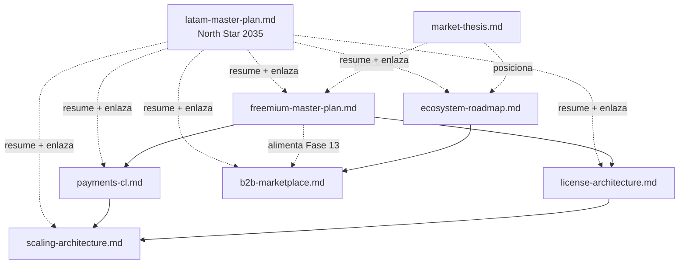

# Estrategia

Documentos lockeados (no se editan sin ADR aprobado). Cubren modelo de negocio, arquitectura
objetivo y decisiones estructurales. Audiencia: fundador, board, design partners avanzados.

## Documentos vigentes

| Documento | Propósito | Status |
|---|---|---|
| [`market-thesis.md`](./market-thesis.md) | **Punto de entrada.** Posicionamiento/moat: por qué existe (infra competitiva para el independiente vs oligopolio), no "otro ERP". | Lockeado v1 — 2026-05-27 |
| [`latam-master-plan.md`](./latam-master-plan.md) | **North Star 2035**: tesis unificadora LATAM (visión, moat, flywheel, AI-native, multi-país, distribución, integraciones-as-platform). Sintetiza + enlaza el resto. | Tesis v1 — 2026-05-26 |
| [`freemium-master-plan.md`](./freemium-master-plan.md) | Modelo de negocio freemium MSI: tiers, microtx, invariantes. | Lockeado v1 — 2026-05-20 |
| [`license-architecture.md`](./license-architecture.md) | Arquitectura técnica del licenciamiento: schema, firma, gating, revocation. | Lockeado v1 — 2026-05-20 |
| [`payments-cl.md`](./payments-cl.md) | Comparativa rails de pago CL + recomendación staged. Research only. | Lockeado v1 — 2026-05-20 |
| [`scaling-architecture.md`](./scaling-architecture.md) | Cómo escala la plataforma (license-server, revocation, telemetría, multi-region). | Lockeado v1 — 2026-05-20 |
| [`ecosystem-roadmap.md`](./ecosystem-roadmap.md) | Visión federada ERP multi-nodo. Fases 1-14. | Lockeado v1 — 2026-05-16 |
| [`b2b-marketplace.md`](./b2b-marketplace.md) | Capa de confianza B2B Fase 13 (ex marketplace-master-plan). | Lockeado v1 — 2026-05-16 |
| [`web-interop.md`](./web-interop.md) | Guía operador para conectar storefront web ↔ pharma-server (3 patrones HTTP). Anchored en ADR-0012. | Draft — 2026-05-24 |

## Cambios a estrategia

1. Abrir ADR en [`../adr/`](../adr/README.md) describiendo la decisión.
2. Aprobado el ADR, editar el doc estratégico afectado y marcar la sección con `> Superseded by ADR-NNNN`.
3. Actualizar `last_review` del doc.
4. Espejar en bitácora dual (repo + vault).

## Dependencias entre documentos

Lectura recomendada: **`market-thesis.md` primero** (el porqué/moat), luego `latam-master-plan.md` (tesis general 2035), y desde ahí el orden del grafo a los docs lockeados.
