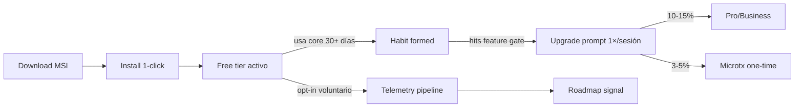

# Plan maestro — Freemium MSI Windows

> **Documento lockeado.** Cualquier cambio requiere ADR aprobado. Las decisiones marcadas
> *"no negociables"* en §6 sólo se modifican con OK explícito y por escrito del fundador.

---

## 1. Vision

pharma-server se distribuye como **MSI nativo Windows freemium**: un único binario que
instala el core ERP completo (POS, inventario, ventas, caja, gastos, recetas, backup local,
reporte diario de ventas) **gratis y para siempre, sin telemetría obligatoria, sin internet,
sin lock-in**. La monetización ocurre por **tiers Pro / Business / Enterprise** y por
**microtransacciones one-time** sobre módulos de alto valor (integración SII automatizada,
branding, automatizaciones, reportes premium, asientos adicionales).

El modelo se inspira en *League of Legends*: producto base de altísima calidad accesible a
todo el mundo; quien obtiene valor profundo paga por amplificarlo.

## 2. Por qué freemium (decisión 2026-05-20)

### 2.1 Diagnóstico del modelo previo (licencia única)

| Métrica | Modelo licencia única | Riesgo |
|---|---|---|
| Adopción inicial | Limitada por cheque upfront (CLP ~$300k+) | Alto: farmacia independiente CL no firma en frío |
| Velocidad de iteración | Feedback lento (sólo de quien pagó) | Producto sin presión de uso real |
| Network effects | Cero (cada instalación aislada) | Fase 12 (marketplace federado) sin masa crítica |
| Defensibilidad | Sólo feature parity | Sin moat real |

### 2.2 Tesis del pivote

> **Más cajas instaladas → más data → mejor producto + leverage para marketplace federado
> (Fase 13). El ERP gratis se convierte en el caballo de Troya del protocolo Ed25519
> firmado.**

Evidencia que respalda: el repo ya tiene construido el protocolo de comercio federado
(`crates/agent/`, `migrations/0008-0014`). El activo diferencial no es el ERP — el ERP es
el vehículo de distribución del activo diferencial.

### 2.3 Funnel objetivo

Hipótesis de conversión (a validar con design partners en Coquimbo/La Serena):
- **Free → Pro**: 8-15% en farmacias con >2 cajas.
- **Free → Microtx**: 3-5% (compra impulsiva tipo "branding pack").
- **Pro → Business**: 20-30% si tienen >1 sucursal.

---

## 3. Tier matrix

| Capacidad | **Free** | **Pro** | **Business** | **Enterprise** |
|---|---|---|---|---|
| **Cajas concurrentes** | 1 | 3 | 10 | Ilimitadas |
| **Sucursales** | 1 | 1 | hasta 5 | Ilimitadas |
| **Retención backup local** | 7 días | 30 días | 90 días | 365 días + S3-compat |
| **Reportes incluidos** | sales-daily | + margins, top-products | + stock-rotation, near-expiry, ABC | + custom queries |
| **Federación opt-in (Fase 13)** | Sólo recibir cards | Quote.request | + po.create | + multi-cluster |
| **Sync online entre nodos** | ❌ | ❌ | ✅ | ✅ + SLA |
| **Integración SII (DTE auto)** | ❌ | Microtx | ✅ | ✅ |
| **ISP controlados Ley 20.000 auto** | Manual export | ✅ | ✅ | ✅ |
| **Telegram bot operativo** | ❌ | Microtx | ✅ | ✅ |
| **Soporte** | Comunidad / docs | Email 48h | Email 24h + chat | SLA 4h + ingeniero asignado |
| **White-label** | ❌ | ❌ | ❌ | ✅ |
| **Multi-cluster (N MSIs centralizados)** | ❌ | ❌ | ❌ | ✅ |
| **Auditoría exportable** | ✅ (CSV) | ✅ | ✅ + firma | ✅ + firma + retención legal |

**Invariante de la matriz**: ninguna fila puede mover funcionalidad existente del Free a un
tier pago. Sólo se *agregan* capacidades nuevas al subir de tier. Ver §6.

## 4. Microtransacciones (catálogo cerrado v1)

One-time purchases desde la web admin del producto. No suscripción, no recurrente. Compra
genera un `.lic` actualizado firmado por el licenser, descargable e importable offline.

| Producto | Tipo | Feature key (`license.features[]`) | Precio CLP (rango target) |
|---|---|---|---|
| **Branding pack** | One-time | `branding.custom_logo` + `branding.themes` | $9.900 – $19.900 |
| **SII unlock** | One-time | `integrations.sii_dte_auto` | $49.900 – $99.900 |
| **Telegram bot** | One-time | `integrations.telegram_bot` | $14.900 – $29.900 |
| **Premium reports pack** | One-time | `reports.margins_daily` + `reports.top_products` + `reports.stock_rotation` + `reports.near_expiry` | $29.900 – $49.900 |
| **Extra cashier seat** | One-time / seat | `seats.extra_cashier` (qty configurable) | $9.900 – $14.900 / seat |
| **Premium support credits** | One-time pack | `support.premium_credits` (1 crédito = 1 ticket SLA 4h) | $14.900 / 5 credits |

**Reglas de microtx**:
- No se descuentan automáticamente al subir de tier — el cliente que ya compró microtx
  conserva la feature aunque baje de tier (es derecho adquirido, marcado en license `bought_addons[]`).
- No hay "exclusivas" temporales tipo skins. Anti-FOMO explícito.
- Combos pueden existir, pero el precio combo nunca > suma de individuales.

## 5. Pricing CL (rangos, no precios finales)

> **Decisión**: los precios finales los cierra el fundador con design partners reales.
> Esta tabla es referencia interna v0. **No publicar.**

| Tier | CLP/mes (target) | CLP/año (target, 2 meses gratis) | Estrategia |
|---|---|---|---|
| Free | $0 | $0 | Adquisición |
| Pro | $14.900 – $24.900 | $149.000 – $249.000 | Conversión habitual (farmacia con ≥2 cajas) |
| Business | $49.900 – $79.900 | $499.000 – $799.000 | Cadenas chicas / multi-sucursal |
| Enterprise | "Contactar" (target $200k+ /mes) | Contrato anual | Custom, requiere ingeniero asignado |

### 5.1 Política de cobros
- **Mensual**: rail Webpay (suscripción) — ver [`payments-cl.md`](./payments-cl.md).
- **Anual**: 2 meses gratis vs 12× mensual. Anclaje a conversión anual.
- **Microtx**: rail Stripe Checkout desde web admin (one-time card).
- **IVA**: precios netos en docs internos. Cliente final ve precios IVA incluido (19% CL).
- **Boleta SII electrónica**: emisión automática en cada cobro (compliance, ver `payments-cl.md` §3).
- **Reembolsos**: 14 días desde el cobro, sin preguntas (Pro/Business). Microtx: 7 días si no usado.

### 5.2 Prorating en upgrades / downgrades
- **Upgrade mid-cycle**: cobro proporcional (días restantes × diferencia diaria). License se
  re-emite inmediatamente.
- **Downgrade mid-cycle**: efectivo al siguiente ciclo (no se reembolsa parcial). License
  actual se respeta hasta `expires_at`.

## 6. Decisiones lockeadas (NO negociables sin OK escrito del fundador)

> Estos invariantes están además respaldados por [ADR-0005](../adr/0005-core-gratis-no-locked-in.md).

### 6.1 Core ERP siempre gratis offline
Funcionalidades **garantizadas en el tier Free, para siempre**:
- POS (ventas + devoluciones + idempotencia + loyalty)
- Inventario (SKU + lote + vencimiento + stock por sucursal)
- Caja (apertura/cierre/arqueo)
- Gastos
- Recetas (incluyendo Ley 20.000 manual con export ISP)
- Backup local on-demand + scheduled
- Reporte `sales-daily`
- Multi-usuario LAN (cajeros + admin + dueño)
- Auditoría completa exportable

**Esto no se mueve a tiers pagos.** Sí pueden agregarse capacidades NUEVAS al Free
(siempre additive, nunca subtractive).

### 6.2 License OFFLINE-FIRST
El server NO debe requerir internet para operar las features ya activadas. Validación de
license es 100% local con clave pública del licenser embebida en el binario. Internet sólo
para: (a) compra/upgrade de tier, (b) refresh opcional de revocation list, (c) telemetría
opt-in.

### 6.3 Telemetría OPT-IN siempre, nunca opt-out, nunca por defecto
- Toggle en setup wizard. Default = OFF.
- Granularidad: el usuario elige qué categorías habilita (errores / uso / performance).
- Sin PII bajo ninguna circunstancia. IDs anonimizados con `tenant_id`-derived hash + salt rotativo mensual.
- Cumple ley 19.628 (Protección de la Vida Privada) y futuro reglamento de datos personales CL.

### 6.4 Sin lock-in de datos
El tier Free incluye **export completo CSV/JSON de TODAS las tablas**: productos,
inventario, ventas, devoluciones, caja, gastos, recetas, audit log. Jamás se cobra por
exportar la propia data. Comando: `pharma export --all --output /path`.

### 6.5 Sin dark patterns
- Máximo **1 upgrade prompt por sesión** (toast no-modal).
- **Cero** prompts durante el POS hot path (vender es sagrado).
- Sin "free trial" que cobra al expirar sin avisar — los tiers pagos no se activan sin
  cobro explícito.
- Sin "fake discount" anclado a precio inventado.

### 6.6 Sin kill-switch remoto
El binario NUNCA se desactiva remotamente. Si el license expira o es revocado, las
features **pagadas** retornan `402 Payment Required`. El **core gratis sigue operativo**.
Para siempre.

---

## 7. Anti-piratería razonable

| Vector | Mitigación | Costo de evasión vs valor del producto |
|---|---|---|
| Compartir `.lic` entre instalaciones | License lleva `tenant_id` embebido + `seat_count`. Server valida en init. | Bajo — pero conversión a Pro cuesta menos que el trabajo |
| Patchear el binario | No prevenimos. Quien patchea ya no era cliente. | N/A |
| Crackear firma Ed25519 | Computacionalmente inviable (curve25519, ~128-bit security). | ∞ |
| Falsificar pubkey del licenser | Pubkey embebida en binario MSI firmado (Authenticode). Reemplazar la pubkey requiere re-firmar el MSI. | Alto |
| Adelantar reloj del sistema para evitar expiry | License expira por `expires_at` UTC + verificación de monotonía vs último timestamp visto. Si reloj retrocede >24h → warning, no bloqueo. | Bajo, pero efecto marginal (grace 30d cubre casos legítimos) |

**Decisión**: Sin DRM agresivo. Sin telemetría obligatoria. Sin kill-switch. La piratería
es un problema de pricing y go-to-market, no de ingeniería.

---

## 8. Riesgos y mitigaciones

| Riesgo | Severidad | Mitigación |
|---|---|---|
| Free canibaliza ventas Pro | Alta | Tier matrix calibrada para que Free sea funcional pero "incompleto" para >2 cajas. Iteración con design partners. |
| Costos de soporte gratis se disparan | Media | Soporte Free = comunidad/docs. Forum + Discord. Sin email gratis. |
| Adopción no llega a masa crítica | Alta | Foco inicial en Coquimbo/La Serena (region first). Partners locales. Marketing word-of-mouth. |
| License-server cae → impacto cobros | Media | Stateless + multi-region (ver `scaling-architecture.md`). SLO 99.9% billing. |
| Cambios SII rompen integración pagada | Media | Versión `integrations.sii_dte_auto` lleva schema version. Updates breaking → free upgrade durante 12 meses post-compra. |
| Marketplace federado no toma vuelo | Baja-Media | El ERP single-player ya tiene valor. Fase 13 es upside, no requisito de viabilidad. |
| Pagos: chargebacks > 1% | Media | Webpay tiene controles. Pol de reembolso 14d limpia disputas tempranas. |

---

## 9. KPIs y métricas de éxito

### 9.1 North star metrics (revisión mensual)
- **Cajas activas mensuales** (Free + paid). Target Q4-2026: 200 cajas.
- **Conversion rate Free → Pro/Business**: target 10% a 90 días.
- **MRR (Monthly Recurring Revenue)**: target Q4-2026 CLP $2M.
- **Microtx velocity**: nº de microtx vendidas /mes /caja Free activa.

### 9.2 Salud del producto
- **Crash rate** por sesión (opt-in telemetry).
- **POS latency p99** (objetivo <50ms — ver `CLAUDE.md`).
- **Tiempo a primer ticket POS** post-instalación (target <15 min).
- **NPS** trimestral a usuarios activos.

### 9.3 Salud comercial
- **CAC** (Customer Acquisition Cost) por canal.
- **LTV/CAC** > 3x objetivo.
- **Churn mensual Pro**: <5%.
- **Net Revenue Retention**: >100% (upgrades + microtx compensan churn).

---

## 10. Rollout phases (alineado con `bitacora.md` BACKLOG)

| Fase | Entregable | Estado | Bloqueador |
|---|---|---|---|
| **F9** | MSI firmado v1.0.0 + smoke VM | Pendiente | Certificado Authenticode |
| **F10a** | `crates/license` (Ed25519 verify + parser) | Diseñado, no codeado | — |
| **F10b** | Feature gate API (`entitled`/`require` + `ApiError::payment_required`) | Diseñado | F10a |
| **F10c** | CLI `pharma license import/status/features` | Diseñado | F10a |
| **F10d** | 1 feature gated POC (`reports.margins_daily`) | Diseñado | F10b |
| **F11a** | `pharma-license-server` skeleton (repo separado) | No iniciado | F10 completo |
| **F11b** | Webpay integration (Pro/Business sub) | No iniciado | F11a |
| **F11c** | Stripe Checkout (microtx) | No iniciado | F11a |
| **F12** | Sync online opt-in entre nodos | Diseño previo, no priorizado | F11 |
| **F13** | Marketplace federado B2B | Doc lockeado, no scaffold | Adopción + F11 |
| **F14** | Cloud companion (web admin + mobile) | Idea | F11 |

---

## 11. Glosario

- **Tier**: nivel de plan (Free, Pro, Business, Enterprise).
- **Microtx**: micro-transacción one-time, no recurrente.
- **Feature key**: identificador único formato `module.feature` (ej. `reports.margins_daily`).
- **Entitlement**: derecho a usar una feature, codificado en `license.features[]`.
- **License (`.lic`)**: documento JSON firmado por el licenser que entitlements de un tenant.
- **Licenser**: emisor autorizado del license. Pubkey embebida en binario.
- **CRL** (Certificate Revocation List): lista firmada de licenses revocados, distribuida por CDN.
- **DID** (`did:pharma:<bs58>`): identificador descentralizado del nodo (ya existe en `crates/agent/identity.rs`).
- **Tenant**: instalación independiente (1 farmacia = 1 tenant, multi-sucursal = sub-bodegas dentro del tenant).
- **Seat**: usuario concurrente autenticado (típicamente 1 caja = 1 seat).

---

## 12. Referencias

- [ADR-0001 — Pivote freemium](../adr/0001-freemium-pivot.md)
- [ADR-0005 — Core gratis no locked-in](../adr/0005-core-gratis-no-locked-in.md)
- [`license-architecture.md`](./license-architecture.md)
- [`payments-cl.md`](./payments-cl.md)
- [`scaling-architecture.md`](./scaling-architecture.md)
- [`b2b-marketplace.md`](./b2b-marketplace.md) — Fase 13, downstream del freemium
- [`../../CLAUDE.md`](../../CLAUDE.md) — sección "Modelo de negocio (freemium, lockeado)"
