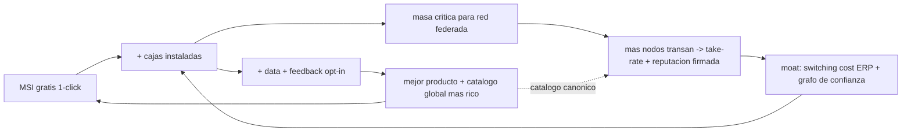
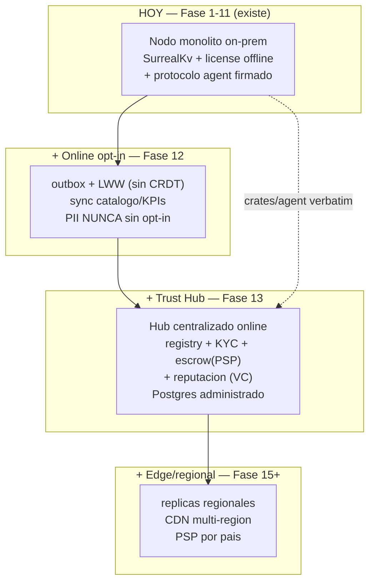

# Plan maestro — Infraestructura digital para farmacias independientes LATAM (2026-2035)

> **Tesis unificadora, no scaffolding.** Este documento es el *north star 2035*: la capa de
> visión que conecta los docs lockeados existentes en un solo flywheel y desarrolla a fondo lo
> que ellos no cubren (AI-native, LATAM multi-país, distribución masiva, integraciones-as-
> platform). **No supersede ni edita** ningún doc lockeado — los **resume y enlaza**. Para el
> detalle de ejecución, seguir los links a cada doc dueño. No introduce código ni toca
> `Cargo.toml`/`migrations/`.
>
> **Cómo leerlo**: cada sección abre con un **veredicto** (decisión, no "depende"), luego el
> desarrollo. Las secciones de temas ya lockeados (§2 modelo, §3 arquitectura, §4 marketplace)
> son resumen + link; la densidad nueva está en §5 distribución, §6 integraciones, §7 AI,
> §8 LATAM.

---

## Invariantes heredados (límites duros, este doc los reafirma)

Todo lo de abajo está subordinado a estos invariantes lockeados. Ninguna apuesta de este
documento puede violarlos; donde una idea los roza, se marca explícitamente.

1. **Core ERP gratis offline para siempre**, additive-only — nunca mover features Free a pago
   ([freemium §6.1](./freemium-master-plan.md), [ADR-0005](../adr/0005-core-gratis-no-locked-in.md)).
2. **Offline-first**: el server opera sin internet; license validation 100% local
   ([freemium §6.2](./freemium-master-plan.md)).
3. **Telemetría opt-in, default OFF, sin PII** (freemium §6.3, Ley 19.628).
4. **Sin lock-in de datos**: export total CSV/JSON gratis (`pharma export --all`) — freemium §6.4.
5. **Sin dark patterns / sin kill-switch remoto**: el core sigue vivo aunque expire la license
   (freemium §6.5-6.6).
6. **Datos sensibles (PII paciente / recetas / ventas) nunca salen del nodo sin opt-in por
   tenant** ([ecosystem-roadmap §4](./ecosystem-roadmap.md); enforced en `crates/api/src/v1/agent.rs` `resolve_federation_tenant`).
7. **No custodiar fondos**: escrow orquestado vía PSP licenciado, nunca DIY ([b2b §3](./b2b-marketplace.md)).
8. **Monolito modular, no microservicios; sin CRDTs; NATS solo cuando la escala lo exija**
   ([b2b §4.2](./b2b-marketplace.md)).

> **Marca `ADR candidate`**: cualquier capa nueva de este documento que no esté ya decidida
> lleva esta marca. Significa: *idea consistente con los invariantes, pero requiere su propio
> ADR aprobado antes de comprometer ingeniería.* La disciplina del repo reserva ADRs para
> decisiones aceptadas — no se escriben stubs por adelantado.

---

## 1. Visión estratégica completa

> **Veredicto**: no estamos construyendo un ERP. Estamos construyendo el **sistema operativo
> del negocio + el riel de confianza y liquidación** para la farmacia independiente LATAM. El
> ERP gratis es el caballo de Troya de distribución; el negocio real es SaaS + take-rate + una
> API de identidad/liquidación verificada reusable ("el Stripe de la confianza para SMB LATAM").

### 1.1 Qué empresa construimos *de verdad*

Tres capas concéntricas, de adentro hacia afuera:

- **Producto core (gratis, para siempre)**: el ERP/POS on-prem. Da valor *single-player* desde
  el día 1, sin red, sin internet, sin cuenta. Es la puerta de entrada y el ancla de identidad.
- **Negocio real (cómo paga las cuentas)**: SaaS por tiers + microtx ([freemium-master-plan.md](./freemium-master-plan.md)),
  y a mayor plazo el take-rate sobre GMV inter-nodo escrowed.
- **Activo defensivo de largo plazo (el moat unicornio)**: el **riel de identidad + reputación
  portable firmada + liquidación verificada**, expuesto como API a terceros (otros
  marketplaces, fintechs, clasificados). Pharma es el beachhead que lo prueba con plata y
  fraude reales — no el mercado final ([b2b §10](./b2b-marketplace.md)).

### 1.2 El moat (por capas, de menor a mayor defensibilidad)

1. **Lock-in saludable de datos operativos**: cuando la farmacia corre su inventario+POS+caja en
   el nodo, el costo de cambio es enorme — no porque la tengamos rehén (export total es gratis,
   invariante §4), sino porque *el sistema operativo del negocio no se reemplaza en una tarde*.
   Un listado se copia; un ERP en uso diario no.
2. **Grafo de reputación portable y firmado**: más valioso cuantos más nodos transan. No se
   replica copiando UI porque está anclado a transacciones firmadas reales (`agent_interaction`,
   `migrations/0008_agent.surql`).
3. **El protocolo como riel default de reorden B2B** (`po.create` firmado, precio canónico
   re-cotizado server-side — ya implementado en `crates/api/src/v1/agent.rs`).

### 1.3 El flywheel

Lectura: el lado izquierdo (gratis → cajas → data → producto) es un loop de **producto** que gira
*hoy*, sin red. El lado derecho (cajas → red → take-rate → moat) es el loop de **plataforma**, que
gira *después*. El primero financia y siembra al segundo. **No invertir el orden** (riesgo #1, §10).

### 1.4 Por qué esto funciona en LATAM (y por qué el legacy es vulnerable)

- **Conectividad irregular + cortes** → *offline-first es una ventaja estructural*, no un nicho.
  El SaaS cloud-only legacy se cae cuando se cae el internet; el nodo no.
- **WhatsApp/transferencia como canal de cierre real** → no se reemplaza el canal, se le inyecta
  confianza por debajo (§4, §5).
- **Transferencia irreversible (sin chargeback)** → buena para escrow del vendedor, devastadora
  para la víctima del comprobante falso → la verificación de transferencia real es la palanca.
- **Oligopolio que ignora al independiente** → 3 cadenas concentran ~90% del retail farmacia CL;
  el independiente es price-taker desatendido por software caro y genérico. Hueco real.
- **Software legacy on-prem farmacéutico**: caro, licencia única upfront, sin red, sin AI, soporte
  pobre, UX de los 2000. Vulnerable a *gratis + offline + 1-click + comunidad + AI*.

### 1.5 Barreras realistas (sin maquillaje)

- Techo del **vertical-pharma CL es bajo** (oligopolio comprime el TAM): buen negocio
  PE/lifestyle, no unicornio por sí solo. El upside exige generalizar el riel ([b2b §10](./b2b-marketplace.md)).
- **Network effects clásicos de marketplace son débiles** aquí (Facebook ya los posee). El efecto
  de red que defiende es protocolo + identidad + lock-in ERP, no listados (§4.3).
- **Muro regulatorio** si se tocan fondos → arquitectura "no custodiamos" obligatoria (invariante §7).
- **Soporte y ops de disputa no escalan con servidores, escalan con gente** → centro de costo real (§10).

---

## 2. Modelo tipo League of Legends aplicado a ERP

> **Veredicto**: el modelo ya está lockeado en [freemium-master-plan.md](./freemium-master-plan.md)
> (tiers Free/Pro/Business/Enterprise + microtx one-time + 7 invariantes). Esta sección **no lo
> reproduce** — añade la lógica de monetización a 10 años: pricing psychology, expansion revenue,
> y el stack de capas futuras (cada una `ADR candidate`).

**Resumen de lo lockeado** (detalle → freemium-master-plan §3-6): core gratis ultra-útil estilo
*LoL*; conversión por tiers (value-metric = nº de cajas/sucursales) y microtx one-time
(branding, SII unlock, Telegram bot, reports pack, seats, support credits). Anti-FOMO explícito,
sin skins temporales, derechos adquiridos (`bought_addons[]`). Rails de pago → [payments-cl.md](./payments-cl.md)
(Webpay primario, Stripe/Khipu/MercadoPago staged).

### 2.1 Pricing psychology (lo que el doc lockeado no detalla)

- **Anclaje anual**: 2 meses gratis vs 12× mensual; el plan anual ancla el LTV y baja churn.
- **Value-metric = cajas**, no features: el cliente entiende "pago por caja", no por SKUs ni por
  módulos. Escala con su éxito, no con su complejidad → percepción de justicia.
- **Anti-FOMO / anti-abuso por diseño** (invariantes §5-6): máx 1 upgrade prompt/sesión, cero en
  POS hot path, sin "fake discount", sin trial que cobra solo. La confianza es el activo de
  conversión a largo plazo — quemarla con dark patterns destruye el flywheel.
- **Gratis que da valor real, no demo lisiado**: el Free debe alcanzar para operar una farmacia
  chica de verdad. La conversión viene del *crecimiento del cliente* (2ª caja, 2ª sucursal), no
  de mutilar el Free. Esto es el corazón del modelo LoL.

### 2.2 Expansion revenue / land-and-expand / NRR

- **Land**: instalar el MSI gratis (CAC ≈ 0, es download).
- **Expand**: el cliente crece (más cajas → Pro → Business; más sucursales → Business; integra SII →
  microtx o tier). El ingreso por cuenta crece sin re-adquirir.
- **NRR > 100% objetivo**: upgrades + microtx + (futuro) take-rate compensan el churn. Esta es la
  métrica que vuelve sano el negocio aunque la adquisición sea lenta (freemium §9.3).

### 2.3 Stack de monetización a 10 años (capas)

| # | Capa | Estado | Defensibilidad | Notas |
|---|---|---|---|---|
| i | **SaaS tiers** | Lockeado (freemium) | Media (lock-in ERP) | Cash-flow temprano, COGS≈0 on-prem |
| ii | **Microtx one-time** | Lockeado (freemium §4) | Baja | Impulso, expansion revenue |
| iii | **Marketplace take-rate** sobre GMV escrowed | `ADR candidate` | Alta (escala con red) | Material solo con cientos de nodos ([b2b §3](./b2b-marketplace.md)) |
| iv | **Embedded payments / fintech** (adelanto de liquidación al vendedor, BNPL de reposición a la farmacia) | `ADR candidate` | Alta | **Solo orquestado vía PSP/entidad licenciada** — invariante §7. No custodiar. |
| v | **Insurance / credit integrations** (seguro de transacción, scoring de crédito de contraparte) | `ADR candidate` | Alta | Producto sobre el grafo de reputación; partner asegurador, no balance propio |
| vi | **API-as-product** (verified-settlement + identity + reputation as a service) | `ADR candidate` | Máxima (el moat unicornio) | El "Stripe de la confianza" ([b2b §10](./b2b-marketplace.md)) |

> **Regla de oro del modelo**: las capas i-ii pagan las cuentas hoy; iii-vi son el upside. No
> proyectar iii-vi como base del runway (b2b §8). Y ninguna capa puede romper los invariantes §1-8 —
> en particular, el core gratis y el offline-first **nunca** se tocan para empujar fintech.

---

## 3. Arquitectura técnica a 10 años

> **Veredicto**: el nodo **no se reescribe** — se generaliza. La evolución es aditiva y por capas
> opt-in: monolito on-prem (hoy) → capa online opt-in → Trust Hub centralizado sobre protocolo
> federado → edge/replicación regional. Detalle de escalamiento en [scaling-architecture.md](./scaling-architecture.md);
> arquitectura del Hub en [b2b §4](./b2b-marketplace.md). Sin microservicios, sin CRDTs, NATS diferido.

### 3.1 Estado actual (lo que ya existe en código)

Monolito modular de crates (`core`, `db`, `api`, `auth`, `jobs`, `telemetry`, `service`, `cli`,
`domain`, `agent`, `license`). SurrealKv embebido (sin red en hot path, POS <50ms p99 objetivo).
Multi-tenant por JWT claim. License Ed25519 offline (`crates/license/`, reusa `crates/agent/`).
Protocolo federado firmado (`crates/agent/{identity,envelope,canonical,card}.rs` +
`/agent/inbox`) que ya **comercia end-to-end** (`po.create` con precio canónico server-side).

### 3.2 Línea de tiempo de evolución (aditiva, opt-in)

- **Online opt-in (Fase 12)**: ya diseñada en [ecosystem-roadmap §2](./ecosystem-roadmap.md) —
  `sync_outbox` + push/pull workers + LWW. Tenant-owned data nunca se pulls; solo catálogo global
  + KPIs agregados opt-in.
- **Trust Hub (Fase 13)**: online, centralizado, money-adjacent. Postgres administrado + object
  storage. **Importa `crates/agent` verbatim** → cero divergencia de verificación de firma entre
  nodo y Hub (una sola implementación de canonicalización = una sola superficie de bug
  criptográfico). Detalle en [b2b §4](./b2b-marketplace.md).
- **Edge/regional (Fase 15+)**: réplicas read-only regionales (sa-east-1), CDN multi-región para
  licenses+CRL (ya en [scaling §4, §7](./scaling-architecture.md)), un PSP por país.

### 3.3 Cuándo monolito / cuándo separar / cuándo NO microservicios / qué se queda local

| Componente | Forma | Por qué |
|---|---|---|
| Nodo ERP (POS, inventario, caja, recetas) | **Monolito on-prem, local-first PARA SIEMPRE** | Hot path <50ms, offline, PII. Nunca a la nube (invariantes §2, §6). |
| Protocolo agente | **Crate compartido** (`crates/agent`) | Misma lib en nodo y Hub → cero divergencia de firma. |
| Trust Hub | **Servicio separado** (repo aparte, online) | Money-adjacent, necesita madurez ops, queries de fraude, multi-region. Separado ≠ microservicios: es **un** servicio monolítico modular. |
| License-server | **Servicio separado** ([ADR-0004](../adr/0004-license-server-separado.md)) | Stateless, CDN-fronted, KMS signer. Ya decidido. |
| Escrow / scoring de fraude | **Workers async sobre cola durable, dentro del Hub** | Event-driven **solo donde se gana el sueldo** (b2b §4.2). NATS cuando la escala lo exija, no antes. |

**Cuándo NO microservicios**: prácticamente siempre en esta etapa. Un monolito modular por crates
escala a decenas de miles de nodos (los nodos son hardware del cliente, COGS≈0). Microservicios
añadirían superficie operacional sin beneficio hasta tener un equipo grande y problemas de escala
reales. **Sin CRDTs**: el modelo es tenant-owned source-of-truth, single-writer por registro →
outbox + LWW basta (b2b §4.2).

### 3.4 Pilares transversales (1 línea + dueño)

- **Identidad / trust criptográfico**: `did:pharma:` → generalizar a `did:trade:` ([b2b §5](./b2b-marketplace.md)); `crates/agent/identity.rs`.
- **Licensing**: Ed25519 offline + CRL firmado por CDN ([license-architecture.md](./license-architecture.md), ADR-0002/0006/0007).
- **Payments**: Webpay-first, staged ([payments-cl.md](./payments-cl.md)); multi-país vía MercadoPago/PSP local.
- **AI agents**: ver §7 (edge-first, opt-in cloud).
- **Observability**: OTLP opt-in, SLOs en [scaling §8](./scaling-architecture.md).
- **Migrations**: append-only, multi-tenant obligatorio (regla CLAUDE.md §3-4).
- **Multi-tenant**: JWT claim + índice compuesto por `tenant` (regla CLAUDE.md §4).

---

## 4. Marketplace B2B farmacéutico

> **Veredicto**: la estrategia está lockeada en [b2b-marketplace.md](./b2b-marketplace.md) — B2B
> vertical farmacia↔distribuidor sobre el protocolo `agent` existente, ERP como anzuelo, escrow
> vía PSP, **densidad geográfica primero** (Coquimbo/La Serena). Esta sección refuerza lo que el
> doc trata más liviano: bootstrap de liquidez, anti-fraude operacional y las capas de producto.

**Resumen de lo lockeado**: el activo diferencial no es el marketplace sino el protocolo federado
firmado anclado a un ERP que ya se vende; monetización en 3 capas (SaaS + take-rate + identity-
API); Hub centralizado sobre federación; **no custodiar fondos**; la palanca real en CL no es
"reputación" sino **verificación de transferencia real** (Khipu/Fintoc) que mata el comprobante
falso. Network effects clásicos de marketplace = débiles; el que defiende es protocolo + identidad
+ lock-in ERP.

### 4.1 Bootstrap concreto de oferta y demanda (el loop)

El cold-start clásico (comprador atrae vendedor) no aplica. El loop real es **oferta-empuja-demanda**:

1. Cada farmacia-nodo le pide a *su* distribuidor unirse para recibir POs firmadas (`po.create`).
2. El distribuidor entra (1 distribuidor abastece a decenas de farmacias → liquidez local inmediata).
3. El distribuidor empuja a *sus otras* farmacias-cliente a poner nodos para mandarle órdenes
   limpias (prueba social: "tu distribuidor ya está").
4. Lock-in ERP + recurrencia de reposición (semanal/mensual, predecible) cierran el loop.

Por eso la densidad geográfica gana: un solo vendedor anclado genera liquidez de toda una región.

### 4.2 Anti-fraude / anti-spam operacional

- **Identidad raíz con 3 anclas**: ClaveÚnica + RUT + titularidad bancaria (Fintoc/Khipu). El mismo
  dato que prueba identidad prueba que la transferencia es real → anti-sybil **y**
  anti-comprobante-falso en un mecanismo ([b2b §5](./b2b-marketplace.md)).
- **Consolidación a la raíz**: 1 RUT → 1 identidad raíz (solo HMAC del RUT, nunca plaintext). La
  mala reputación no se escapa creando cuenta nueva.
- **Reglas primero, ML después**: velocidad de transacción, mismatch nombre-titular vs KYC, device/IP
  fingerprint, patrón nueva-cuenta + alto-valor + urgencia. ML sin datos es over-engineering.
- **Reputación = solo transacciones escrowed completadas** (no reviews auto-reportadas) → cada punto
  costó plata real, caro de falsificar.

### 4.3 Capas de producto (sobre el protocolo)

Trust system · reputation portable (Verifiable Credentials) · escrow (PSP) · quote system
(`quote.request`/`response`) · inventory exchange (catálogo canónico global) · procurement
intelligence · demand prediction (§7) · regional pricing. Todas se construyen *sobre* el mismo
protocolo firmado; el cliente compra "no me estafan y reordeno fácil", **nunca** "DID Ed25519"
(la cripto es plomería invisible).

---

## 5. Estrategia de distribución masiva

> **Veredicto**: distribución antes que monetización (modelo Riot). El vector es un **MSI gratis,
> offline, 1-click** que da valor solo; el motor de crecimiento es **densidad regional + partners
> gatekeeper (contadores y químicos) + WhatsApp + soporte-como-growth + onboarding asistido por
> AI**. Targets de fleet en [scaling §1](./scaling-architecture.md) (1k nodos Q4-2026 → 25k Q4-2027).

### 5.1 Competir contra el legacy

| Eje | Legacy on-prem farmacéutico | pharma-server |
|---|---|---|
| Precio de entrada | Licencia única CLP $300k+ upfront | **Gratis** (download MSI) |
| Instalación | Instalador pesado, técnico on-site | **1-click MSI**, sin Docker/Postgres aparte |
| Internet | Variable | **Offline-first**, opera sin red |
| Datos | Formatos propietarios, lock-in | **Export total CSV/JSON gratis** (invariante §4) |
| AI / red | Inexistente | Edge AI (§7) + red federada (§4) |
| Soporte | Pobre, caro | Comunidad + docs + AI; SLA en tiers pagos |

La asimetría es brutal: el legacy cobra upfront por menos producto. No competimos en features
primero — competimos en **fricción cero de adopción**.

### 5.2 Funnel y conversión

El funnel detallado vive en [freemium §2.3](./freemium-master-plan.md) (Download → Install → Free
activo → hábito 30d → gate → upgrade). Aquí lo relevante de distribución: maximizar el **top of
funnel** (instalaciones) porque la conversión es additive y el CAC del Free es ≈ download. Cada
caja instalada, aunque nunca pague, es (a) data opt-in, (b) masa para la red, (c) prueba social,
(d) candidata a expansion revenue cuando el negocio crezca.

### 5.3 Canales LATAM reales

- **WhatsApp / Telegram**: donde vive el B2B y la farmacia chica. Soporte, onboarding, alertas,
  bot operativo (microtx). No se reemplaza el canal; se le inyecta producto.
- **YouTube + docs**: tutoriales de instalación y operación = soporte que escala a costo marginal cero.
- **Soporte remoto**: asistencia de instalación como momento de adquisición (no de costo).
- **Partners gatekeeper de alto leverage** (lo más subestimado):
  - **Contadores**: tocan a decenas de farmacias, deciden el software, valoran export limpio y SII.
  - **Químicos farmacéuticos / regentes**: autoridad técnica de la farmacia indep.; su recomendación
    convierte.
  - **Distribuidores**: canal natural (empujan nodos a sus clientes — el loop de §4.1).
- **Densidad regional primero** (Coquimbo/La Serena) → liquidez + confianza por proximidad + soporte
  simple, luego replicar región por región. **TikTok / loops de consumidor = distracción**, no ahora.

### 5.4 Comunidad y soporte como growth

- **Comunidad** (Discord/foro): soporte Free = comunidad + docs (no email gratis → contiene el costo,
  freemium §8). La comunidad genera contenido, reduce tickets y crea pertenencia.
- **Soporte como growth, no como costo**: cada interacción bien resuelta es referral. Los tickets
  alimentan docs y el roadmap.
- **AI onboarding** (§7): copiloto que guía la instalación y primeras ventas → baja el time-to-first-
  POS (<15 min objetivo, freemium §9.2) sin sumar headcount de soporte.
- **Referral**: incentivos B2B (créditos de soporte/microtx por traer otra farmacia o al distribuidor).

---

## 6. Ecosistema de integraciones

> **Veredicto**: modelo **Shopify App Store / Steam**. Taxonomía clara **core vs plugin (oficial) vs
> marketplace third-party**. El core se mantiene pequeño y estable; las integraciones de país/hardware
> son plugins oficiales opt-in; y a largo plazo una **API pública + SDK** habilita un marketplace de
> apps de terceros con revenue-sharing. Rails de pago ya decididos en [payments-cl.md](./payments-cl.md).

### 6.1 Taxonomía (qué es qué y por qué)

| Integración | Clase | Por qué |
|---|---|---|
| SII (DTE / boleta) | **Plugin oficial** (microtx/tier) | Crítico CL pero país-específico; no debe inflar el core. Provider DTE en license-server ([payments §3.2](./payments-cl.md)). |
| ISP / controlados Ley 20.000 | **Plugin oficial** | Compliance CL; export manual en Free, auto en pago (freemium tier matrix). |
| Transbank / Webpay, MercadoPago, Khipu, Fintoc, Stripe | **Plugin oficial (pagos)** | Rails staged por país ([payments-cl.md](./payments-cl.md)); un PSP por país, mismo protocolo. |
| WhatsApp / Telegram bot | **Plugin oficial** (microtx) | Canal operativo LATAM; opt-in. |
| POS hardware, scanners, impresoras térmicas, balanzas | **Core (drivers) + plugin** | El POS debe funcionar con hardware estándar out-of-the-box; hardware exótico = plugin. |
| Couriers / logística | **Plugin / third-party** | Variará por región; candidato a marketplace third-party. |
| ERPs externos / contabilidad | **API pública + third-party** | El export y la API estable (invariante §4, regla CLAUDE.md UI desacoplada) ya lo permiten. |
| Apps verticales (convenios isapre, fidelización avanzada, etc.) | **Marketplace third-party** | Largo plazo, sobre SDK público + revenue-sharing. |

### 6.2 Principio de diseño

- **Core pequeño y estable**: solo lo que toda farmacia necesita offline (POS, inventario, caja,
  recetas, backup, sales-daily). Invariante: el core nunca depende de un servicio externo para
  operar (CLAUDE.md regla de diseño).
- **Plugins oficiales opt-in**: integraciones de país/hardware/canal, monetizadas por tier/microtx.
- **Marketplace third-party (Fase tardía, `ADR candidate`)**: API pública versionada (`/api/v1`, ya
  existe el patrón) + SDK + revenue-sharing con devs. Esto es lo que convierte la plataforma en
  ecosistema (modelo Shopify/Steam) y multiplica el valor sin que escalemos ingeniería 1:1.

---

## 7. AI-native pharmacy ecosystem

> **Veredicto**: **edge-first**. La IA útil corre **local** sobre la data del nodo (privacidad +
> latencia + costo) usando modelos pequeños/embeddings; la IA pesada es **opt-in cloud** y nunca
> envía PII sin consentimiento explícito por tenant (invariante §6). Cualquier feature que mande
> datos fuera del nodo es `ADR candidate`. La IA es asistencia, no autonomía sobre dinero/stock.

### 7.1 Arquitectura AI-native (edge vs cloud)

- **Edge AI (local, default)**: modelos pequeños + embeddings + RAG sobre el catálogo, ventas e
  inventario *del propio nodo*. Inferencia local = sin costo marginal de API, sin latencia de red,
  sin que la PII salga. Encaja con offline-first (la IA básica funciona sin internet).
- **Cloud AI (opt-in, `ADR candidate`)**: tareas que exigen modelos grandes (OCR complejo de
  recetas, NLU avanzado, copiloto conversacional rico). Solo con opt-in por tenant; datos
  minimizados/anonimizados; nunca PII de paciente sin consentimiento. Costo controlado por
  batching + caché.
- **RAG / embeddings**: el catálogo canónico global (`barcode_catalog`) + el historial local
  alimentan retrieval para sugerencias y copiloto. Embeddings se computan local o en cloud opt-in.

### 7.2 Casos por ROI (de mayor a menor retorno inmediato)

1. **Forecasting / stock prediction**: predecir quiebres y sobrestock por SKU/estacionalidad →
   menos capital muerto, menos venta perdida. Edge, sobre ventas locales.
2. **Compras sugeridas (no autónomas)**: generar OC propuestas (qty, proveedor, timing) que el
   humano aprueba. *Nunca* comprar solo — la IA asiste, el operador decide.
3. **Detección de anomalías / fraude**: arqueos raros, descuentos anómalos, mermas, patrones de
   robo interno. Reglas primero, ML después (mismo principio que §4.2).
4. **Pricing optimization**: márgenes por rotación/competencia/vencimiento (liquidar near-expiry).
5. **OCR de recetas y facturas**: hoy stub `scan-invoice` ([ecosystem-roadmap §1, Fase 5](./ecosystem-roadmap.md));
   offline = on-device/tesseract, online opt-in = cloud vision. Acelera captura sin tipeo.
6. **Copiloto interno + soporte automático**: onboarding guiado (§5.4), Q&A operativo, generación de
   reportes en lenguaje natural. Baja el costo de soporte y el time-to-value.
7. **Voice interfaces**: manos-libres en mesón (consultar stock/precio hablando). Edge STT donde
   sea viable.

### 7.3 Privacidad, costo, restricciones

- **PII nunca sale sin opt-in** (invariante §6). Default = todo local.
- **Costo**: edge = COGS≈0; cloud = opt-in y batched. No quemar margen con inferencia gratis
  ilimitada.
- **No autonomía sobre dinero/stock**: la IA propone, el humano dispone. Evita el riesgo regulatorio
  y de confianza de un agente que compra/vende solo.

---

## 8. Estrategia LATAM

> **Veredicto**: secuencia **Chile → Perú → Colombia → México → Argentina → Brasil**, region-first
> dentro de cada país. El binario, el protocolo y la license se reusan **idénticos**; lo que se
> **localiza** es la capa fiscal, los rails de pago (un PSP/DTE por país) y el idioma (es→pt en
> Brasil). El offline-first es el argumento universal (conectividad irregular en toda la región).

### 8.1 Por qué este orden

- **Chile primero**: cliente real (Tu Farmacia, Coquimbo), ClaveÚnica + RUT + open banking maduros,
  base de código y compliance ya construidos. Es el laboratorio del protocolo con plata y fraude reales.
- **Perú/Colombia**: cercanía cultural/operativa, fragmentación similar, MercadoPago presente.
- **México**: mercado grande, MercadoPago fuerte; mayor complejidad regulatoria/fiscal (CFDI).
- **Argentina/Brasil**: mayor tamaño pero más fricción (inflación/cambio en AR; idioma + tamaño +
  regulación en BR). Última ola, cuando el playbook esté probado.

### 8.2 Matriz por país (qué localizar)

| País | Compliance/fiscal | Rail de pago primario | Facturación electrónica | Idioma | Notas |
|---|---|---|---|---|---|
| **Chile** | ISP/Ley 20.000, Ley 19.628, Ley Fintech 21.521 | Webpay → Khipu/Fintoc | Boleta/Factura SII (DTE) | es | Base; ClaveÚnica como ancla de identidad |
| **Perú** | DIGEMID; protección de datos | MercadoPago / local | SUNAT (CPE) | es | — |
| **Colombia** | INVIMA; Habeas Data | MercadoPago / PSE | DIAN (factura electrónica) | es | PSE = transferencia local |
| **México** | COFEPRIS | MercadoPago | CFDI (SAT) | es | Mercado grande, fiscal complejo |
| **Argentina** | ANMAT | MercadoPago | AFIP | es | Inflación/cambio = reto de pricing |
| **Brasil** | ANVISA; LGPD | MercadoPago / Pix | NF-e / Pix | **pt** | Tamaño + idioma + regulación = última ola |

### 8.3 Qué se reusa vs qué se localiza

- **Idéntico (cero cambio)**: binario MSI, SurrealKv embebido, protocolo `agent` firmado, license
  Ed25519, ERP core, modelo freemium.
- **Localizado (plugin por país)**: integración fiscal/DTE, rails de pago (un PSP por país, mismo
  protocolo — [b2b §10](./b2b-marketplace.md)), idioma de UI/errores, set de sustancias controladas y
  compliance regulatorio, hardware POS típico, modelo de soporte (WhatsApp local).
- **Conectividad/hardware**: offline-first justifica el bajo requisito de red; hardware mínimo (i3 +
  SSD + 8GB, CLAUDE.md). La informalidad y los cortes de luz/internet son la norma → ventaja, no obstáculo.

---

## 9. Roadmap maestro 2026-2035

> **Veredicto**: **bootstrap por defecto** — el ERP SaaS (vendible hoy) financia el burn; VC solo
> para acelerar take-rate/API una vez probado el PMF B2B. Crecer el equipo *después* del PMF, no
> antes. Sintetiza Fases 1-14 ([ecosystem-roadmap](./ecosystem-roadmap.md), CLAUDE.md) + el roadmap
> 24 meses ([b2b §7](./b2b-marketplace.md)) y lo extiende a 2035.

### 9.1 Tabla maestra por ventana

| Ventana | Producto/Técnico | Comercial / GTM | Infra / Fintech | Red / AI | Gate de decisión |
|---|---|---|---|---|---|
| **2026 H1** | MSI v1.0.0 firmado (Fase 9); license layer cerrado (Fase 10 ✓) | Design partners Coquimbo/La Serena | — | — | ¿MSI estable en VM limpia? |
| **2026 H2** | license-server + Webpay (Fase 11); 1ª region densa | Conversión Free→Pro; partners contadores/químicos | Webpay + DTE (SimpleAPI) | Edge AI v0 (forecasting) | ¿10% conversion a 90d? |
| **2027** | Sync online opt-in (Fase 12); Trust Hub MVP (Fase 13 M0-6) | 20-40 nodos activos; 1ª distribuidora | Escrow v1 vía PSP + Fintoc/Khipu | Reputación v1; AI compras sugeridas | ¿PMF B2B regional? |
| **2028** | Hub maduro; API pública v1 (integraciones) | 2ª región CL; expansión horizontal SMB adyacente | Embedded payments (`ADR candidate`) | Marketplace third-party beta | ¿Take-rate material? ¿Levantar capital? |
| **2029-2030** | Generalizar `did:pharma`→`did:trade`; edge nodes regionales | Perú/Colombia (PSP local) | Identity/verified-settlement API como producto | Demand prediction cross-nodo (opt-in) | ¿API vende a terceros fuera de pharma? |
| **2031-2035** | Plataforma multi-país; ecosistema de apps | México → Argentina → Brasil | Insurance/credit (`ADR candidate`); multi-PSP | Riel de reputación neutral multi-red | Plan base (negocio sólido) vs upside (infra unicornio) |

### 9.2 Funding, hires y disciplina

- **Bootstrap** sobre licencias ERP + consultoría = ruta de menor dilución y mayor opcionalidad
  (b2b §8). Burn realista 2-3 personas, ~US$15-35k/mes.
- **VC opcional** (US$300-700k pre-seed/seed) solo para *acelerar* take-rate/API tras señal de PMF.
- **Hires**: primero ingeniería core; luego **ops de soporte/disputa** (el OPEX real de un
  marketplace de confianza es gente, no servidores — §10); compliance/legal antes de tocar fondos.
- **Cuándo NO crecer**: antes del PMF, antes de tener NRR>100%, o para construir el protocolo
  elegante en vez del producto que paga (riesgo #1, §10).

### 9.3 Métricas north-star (revisión mensual)

Cajas activas mensuales · conversion Free→Pro · MRR/NRR · microtx velocity (freemium §9) ·
nodos activos · GMV inter-nodo · take-rate · **tasa de fraude en txn escrowed (north-star de
confianza)** · reorder rate · CAC payback (b2b §8). Targets de escala en [scaling §1](./scaling-architecture.md).

---

## 10. Riesgos existenciales

> **Veredicto**: el mayor riesgo no es técnico — es **construir el protocolo elegante en vez del
> producto aburrido que el mercado paga**. El roadmap (§9, [b2b §7](./b2b-marketplace.md)) prohíbe
> explícitamente construir protocolo antes que escrow. Abajo, cada riesgo con mitigación concreta.

| # | Riesgo | Severidad | Mitigación concreta | Dueño/fase |
|---|---|---|---|---|
| 1 | Fundador construye cripto/federación en vez de escrow+reorden que pagan | **Crítica** | Roadmap prohíbe protocolo antes que escrow; gate de PMF antes de generalizar | §9 |
| 2 | Oligopsonio farmacéutico (TAM bajo, independiente price-taker) | Alta | Beachhead = prueba de protocolo, no mercado final; generalizar a SMB ([b2b §10](./b2b-marketplace.md)) | 2028+ |
| 3 | Muro regulatorio de fondos (CMF/UAF/Ley 21.521) | Alta | **No custodiar** — orquestar vía PSP licenciado (invariante §7) | Fase 13 |
| 4 | Fragilidad reputacional (una estafa viral mata la marca) | Alta | Tiering conservador, límites por confianza, disputa humana temprana, comunicación proactiva | Fase 13 |
| 5 | Incumbente (Facebook/ML) copia verificación de transferencia | Media | v1 es B2B (no compiten ahí); moat = lock-in ERP + protocolo, no el feature aislado | §1.2, §4.3 |
| 6 | Soporte gratis que no escala / costos disparados | Media | Free = comunidad + docs (sin email); AI onboarding; SLA solo en pago (freemium §8) | §5.4 |
| 7 | Ransomware/malware en nodos on-prem; pérdida de datos | Media | Backup local programado + restore guiado (ecosystem-roadmap §1 Fase 8); export total; hardening MSI (Fase 9) | Fase 8-9 |
| 8 | Piratería / forks del binario | Baja | Anti-piratería razonable sin DRM agresivo; piratería = problema de pricing, no de ingeniería (freemium §7) | locked |
| 9 | Dependencia bancaria / rail de pago | Media | Multi-rail staged (Webpay→Stripe→Khipu→MercadoPago); un PSP por país ([payments-cl.md](./payments-cl.md)) | Fase 11+ |
| 10 | Fricción KYC mata el funnel B2B | Media | KYC progresivo por tier (no todo el día 1); ERP da valor single-player primero (b2b §9) | Fase 13 |
| 11 | Gaming de reputación (sybil, colusión) | Media | Reputación = solo txn escrowed; identidad anclada a banco+RUT; consolidación a raíz (§4.2) | Fase 13 |
| 12 | Regulación multi-país fragmentada | Media | Localización por plugin; un PSP/DTE por país; entrar país por país probado (§8) | 2029+ |
| 13 | License-server cae → impacto cobros | Media | Stateless + multi-region + CDN; core gratis sigue vivo sin internet (invariantes §2, §5; [scaling §11](./scaling-architecture.md)) | Fase 11 |

---

## 11. Resultado final

### 11.1 En una frase

> **El sistema operativo gratuito y offline de la farmacia independiente LATAM, que se convierte en
> el riel de confianza y liquidación verificada del comercio SMB de la región.**

### 11.2 Resumen ejecutivo

Distribuimos un ERP/POS gratis, offline-first, 1-click (modelo *LoL*: core ultra-útil para todos),
que da valor single-player desde el día 1 y se monetiza por tiers + microtx. Cada caja instalada
siembra dos loops: uno de **producto** (data → mejor producto) que gira hoy, y uno de **plataforma**
(masa → red federada → take-rate → moat) que gira después. El activo diferencial ya construido es el
**protocolo de comercio federado firmado** (`crates/agent`), no el ERP — el ERP es su vehículo de
distribución. Sobre ese protocolo se levanta un marketplace B2B de confianza (escrow vía PSP,
identidad anclada a banco+RUT, reputación portable) cuya generalización es la ruta unicornio: el
"Stripe de la confianza" para SMB LATAM.

### 11.3 Plan base vs upside

- **Plan base (alcanzable, debe ser el objetivo)**: negocio rentable sólido sobre ERP SaaS + take-
  rate regional. Bootstrap, baja dilución. Esto **debe** lograrse aunque el upside no llegue.
- **Upside (estrecho, plurianual)**: el riel de identidad/liquidación verificada se vuelve producto
  API reusable por otros marketplaces/fintechs. Arquitectar *ahora* (`did:trade`, topics agnósticos),
  probar *luego*. Construir para el upside sin lograr el plan base es cómo se muere con buena
  arquitectura (b2b §10).

### 11.4 Las decisiones difíciles del fundador

1. **Resistir el enamoramiento del protocolo**: construir escrow + reorden (aburrido, paga) antes que
   más cripto (elegante, no paga). Es el riesgo #1.
2. **Mantener el core gratis sagrado**: nunca mover features al pago ni romper offline-first, aunque
   tiente para forzar conversión. La confianza ES el activo de distribución.
3. **No custodiar fondos jamás**: orquestar vía PSP licenciado, aunque sea más lento. Tocar plata
   DIY hunde el barco.
4. **Densidad antes que expansión**: ganar una región completa antes de saltar a la siguiente, aunque
   el TAM nacional tiente.
5. **Bootstrap mientras se pueda**: levantar VC solo para acelerar lo ya probado, no para descubrir el PMF.

### 11.5 ADR candidates generados por este documento

Abrir cada uno **solo cuando se valide** la apuesta correspondiente (la disciplina del repo reserva
ADRs para decisiones aceptadas):

| Tema | Sección | Pre-requisito para abrir el ADR |
|---|---|---|
| Marketplace take-rate sobre GMV escrowed | §2.3 (iii), §4 | Escrow v1 funcionando + cientos de nodos |
| Embedded payments / fintech (adelanto, BNPL) vía PSP | §2.3 (iv) | Partner PSP/entidad licenciada confirmado |
| Insurance / credit integrations sobre reputación | §2.3 (v) | Grafo de reputación maduro + partner asegurador |
| API-as-product (verified-settlement / identity) | §2.3 (vi), §1.1 | Demanda de un tercero fuera de pharma |
| Cloud AI que procesa datos fuera del nodo | §7.1 | Diseño de minimización/anonimización + opt-in por tenant |
| Marketplace de apps third-party + revenue-sharing | §6.2 | API pública v1 estable + devs interesados |

---

## 12. Referencias

- [`freemium-master-plan.md`](./freemium-master-plan.md) — modelo de negocio (tiers, microtx, invariantes)
- [`license-architecture.md`](./license-architecture.md) — licenciamiento Ed25519 offline
- [`scaling-architecture.md`](./scaling-architecture.md) — escalamiento license-server + telemetría + multi-region
- [`payments-cl.md`](./payments-cl.md) — rails de pago CL + secuencia LATAM
- [`ecosystem-roadmap.md`](./ecosystem-roadmap.md) — Fases 1-14, sync opt-in, protocolo agente
- [`b2b-marketplace.md`](./b2b-marketplace.md) — capa de confianza B2B (Fase 13), análisis fundador/VC
- ADRs: [0001](../adr/0001-freemium-pivot.md) · [0005](../adr/0005-core-gratis-no-locked-in.md) · resto en [`../adr/`](../adr/README.md)
- Código: `crates/agent/{identity,envelope,canonical,card}.rs` · `crates/license/` · `crates/api/src/v1/agent.rs`
- [`../../CLAUDE.md`](../../CLAUDE.md) — contexto del proyecto
