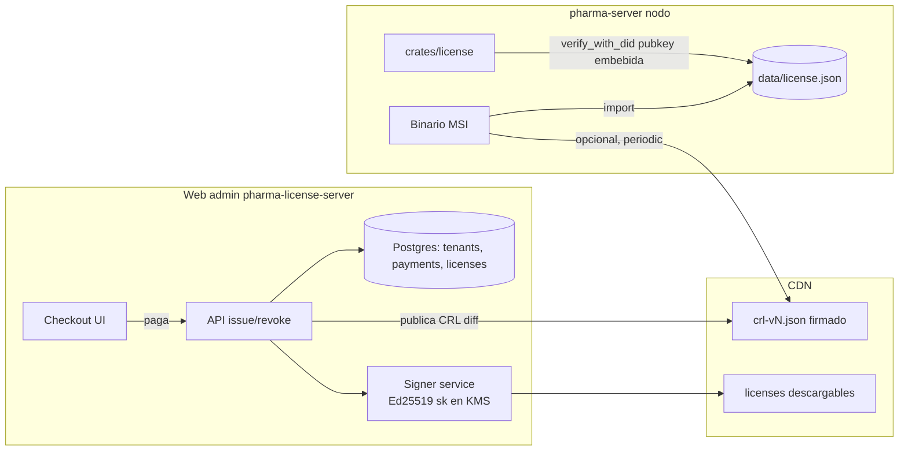
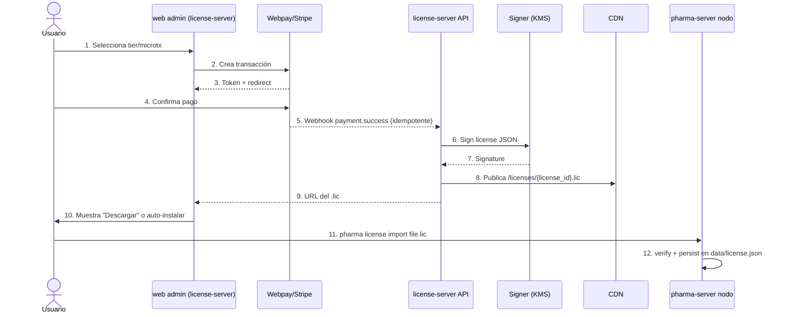
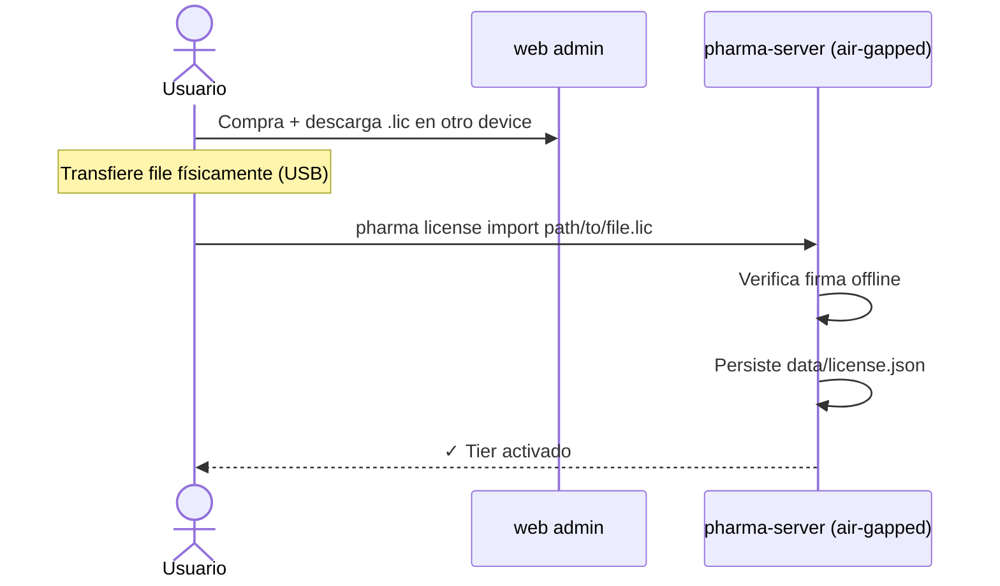

# Arquitectura de licenciamiento

> **Documento lockeado.** Cambios al esquema del license file requieren ADR + versión nueva
> del schema con compat backward. No se rompe compat de licenses ya emitidas.

---

## 1. Overview

El licenciamiento de pharma-server se basa en **license files JSON firmados con Ed25519**,
emitidos por un servicio centralizado (`pharma-license-server`, repo separado, ver
[ADR-0004](../adr/0004-license-server-separado.md)) y verificados **100% offline** por el
binario embebiendo la clave pública del licenser. Reusa la infraestructura criptográfica
ya construida en `crates/agent/` (Ed25519 + canonical-JSON), no introduce nueva primitiva.

### 1.1 Propiedades garantizadas

- **Offline-first**: validación sin red, sin DNS, sin certificados X.509.
- **No-repudio**: firma Ed25519 sobre canonical-JSON. Tampering detectable bit a bit.
- **Multi-key ready**: license lleva `key_id`; rotación sin invalidar licenses viejas.
- **Revocation soporte**: CRL firmado, distribuido por CDN, consultado opcionalmente.
- **Sin telemetría obligatoria**: no se reporta uso al licenser para validar.
- **Graceful degradation**: license expirado → features pagadas a 402; core gratis sigue.

### 1.2 Diagrama de contexto



---

## 2. License document schema

### 2.1 Esquema (versionado, v1)

```jsonc
{
  "schema_version": 1,                             // entero. Bump → incompatible. Compat backward obligatoria.
  "license_id": "lic_01HX5...ULID",                // ULID, único global.
  "tenant_id": "uuid-v4",                          // tenant pharma-server al que pertenece.
  "tier": "free | pro | business | enterprise",
  "features": [                                    // entitlements activos. Ver §9 catálogo.
    "reports.margins_daily",
    "integrations.sii_dte_auto",
    "branding.custom_logo"
  ],
  "bought_addons": [                               // microtx one-time. Sobreviven downgrades.
    {
      "addon_id": "branding_pack_v1",
      "feature_keys": ["branding.custom_logo", "branding.themes"],
      "purchased_at": "2026-05-20T14:32:11Z",
      "order_id": "ord_..."
    }
  ],
  "seat_count": 3,                                 // concurrent users máx.
  "issued_at": "2026-05-20T14:00:00Z",             // RFC3339 UTC.
  "expires_at": "2027-05-20T14:00:00Z",            // RFC3339 UTC. null = perpetuo (sólo Free).
  "issuer_did": "did:pharma:<bs58 pubkey>",        // DID del licenser. Match con LICENSER_DID embebido.
  "key_id": "lk-2026-01",                          // identificador de la clave del licenser. Ver §6.
  "signature": "<base64 ed25519 sobre canonical JSON sin signature>",

  // Opcionales (extensibilidad sin schema_version bump):
  "metadata": {
    "billing_cycle": "monthly | yearly | one_time",
    "next_renewal_at": "2026-06-20T14:00:00Z",
    "support_sla_hours": 24,
    "white_label": false
  }
}
```

### 2.2 Reglas del schema

1. **Canonicalización antes de firmar**: keys ordenadas lexicográficamente, sin whitespace,
   UTF-8. Idéntico patrón a `crates/agent/src/canonical.rs:1-60`.
2. **Schema version forward-compat**: parsers de versión N deben ignorar campos desconocidos
   sin error. Schema bumps requieren ADR + plan de migración para licenses en circulación.
3. **`expires_at = null` legal sólo para `tier: "free"`**. Pago genera `expires_at` finito.
4. **`bought_addons[]` es append-only**. Un addon comprado nunca se quita salvo refund explícito
   (en cuyo caso se emite license nuevo con `bought_addons` reducido).
5. **`features[]` se deriva de** `tier`'s base entitlements + `flatMap(bought_addons[].feature_keys)`.
   El license server hace este merge antes de firmar. El nodo confía en `features[]` y no re-deriva.

---

## 3. Fundamento criptográfico (reuso de infra existente)

### 3.1 Lo que ya está en el repo

- **Sign/verify**: `crates/agent/src/identity.rs:79-117`
  - `sign(payload: &[u8]) -> Signature`
  - `verify_with_did(did: &str, payload: &[u8], sig: &Signature) -> Result<()>`
  - `did_from_verifying_key(vk: &VerifyingKey) -> String` (formato `did:pharma:<bs58>`)
- **Canonical JSON**: `crates/agent/src/canonical.rs` — keys sorted, no whitespace, RFC8785-lite.
- **Envelope pattern**: `crates/agent/src/envelope.rs:42-99` — payload → canonical → sign → wrap.

### 3.2 Lo que se agrega (mínimo)

En `crates/license/src/lib.rs` (NUEVO crate):

```rust
/// Pubkey del licenser embebida en el binario. Hardcoded constant.
/// Ver §6 para rotación.
pub const LICENSER_KEYS: &[(&str, &str)] = &[
    // (key_id, did)
    ("lk-2026-01", "did:pharma:<bs58 de la pubkey vigente>"),
    // Versiones anteriores siguen aquí para validar licenses viejas:
    // ("lk-2025-01", "did:pharma:..."),
];

pub struct License { /* §2.1 schema */ }

impl License {
    /// Parsea + valida firma + verifica que key_id existe en LICENSER_KEYS.
    /// NO valida expiry — eso es responsabilidad del caller (puede haber grace period).
    pub fn parse_and_verify(json: &[u8]) -> Result<Self, LicenseError>;

    /// `expires_at` <= now y no en grace period.
    pub fn is_expired(&self, now: DateTime<Utc>, grace: Duration) -> bool;

    /// Helper de feature gate (ver §7).
    pub fn entitled(&self, feature: &str) -> bool;
}
```

### 3.3 Por qué Ed25519 (no RSA, no ECDSA P-256)

| Criterio | Ed25519 | RSA-2048 | ECDSA P-256 |
|---|---|---|---|
| Tamaño pubkey | 32 bytes | 256 bytes | 64 bytes |
| Tamaño firma | 64 bytes | 256 bytes | 64-72 bytes |
| Performance verify | ~70k ops/s | ~5k ops/s | ~50k ops/s |
| Determinista (sin nonce) | ✅ | ✅ | ❌ (riesgo nonce-reuse) |
| Ya está en repo | ✅ (`crates/agent`) | ❌ | ❌ |
| Side-channel resistance | Sí | Caso por caso | Caso por caso |

Decisión Ed25519 ratificada por [ADR-0002](../adr/0002-license-ed25519-offline.md).

---

## 4. Activation flows

### 4.1 Online (web checkout) — flujo primario



### 4.2 Offline (compra remota, instalación air-gapped)



### 4.3 Auto-activation (futuro, opcional)

Pro/Business tier: el nodo puede ser configurado con un `LICENSE_TOKEN` (one-time token
short-lived emitido al checkout) que descarga el `.lic` automáticamente al primer boot.
No-default, opt-in explícito durante setup wizard.

---

## 5. Refresh, expiración y revocation

### 5.1 Refresh periódico (opcional, opt-in)

- Default: **OFF**. Activable en config (`license.refresh_enabled = true`).
- Si ON: cada 7 días (jittered ±24h) el nodo hace `HEAD /licenses/{license_id}` al license-server.
- 200 → no acción. 404 → license revocado (ver §5.3). 5xx → retry exponencial, no degrade.
- Si offline >30 días Y `expires_at` < `now` → ver §5.2 graceful degradation.

### 5.2 Graceful degradation por expiry

```
┌─ License vigente ──────────────────────────────────────────────┐
│ now < expires_at                                                │
│ → features pagadas: OK                                          │
│ → core gratis: OK                                               │
└─────────────────────────────────────────────────────────────────┘
              │
              ▼ (expires_at pasa)
┌─ Grace period (default 30 días post-expiry) ──────────────────┐
│ now < expires_at + grace                                        │
│ → features pagadas: OK + warning toast 1×/día                   │
│ → core gratis: OK                                               │
└─────────────────────────────────────────────────────────────────┘
              │
              ▼ (grace agotado)
┌─ Expired hard ─────────────────────────────────────────────────┐
│ now > expires_at + grace                                        │
│ → features pagadas: 402 PAYMENT_REQUIRED                        │
│ → core gratis: OK (jamás se bloquea)                            │
│ → CLI/admin muestra "Renueva en https://..."                    │
└─────────────────────────────────────────────────────────────────┘
```

### 5.3 Revocation (CRL firmado distribuido por CDN)

Ver detalle completo en [ADR-0006](../adr/0006-revocation-strategy-signed-crl.md).

Resumen:
- License-server publica `crl-v{N}.json` en CDN cada vez que revoca una license. Lista
  firmada Ed25519 por el licenser, con monotonically increasing version.
- Nodo descarga CRL diff incremental si `refresh_enabled=true`. Cache local.
- Si una license aparece en CRL: trato idéntico a "expired hard". Core gratis OK,
  features pagadas → 402.
- **CRL es opcional**: si el nodo nunca conecta, la license es válida hasta `expires_at`.
  Trade-off aceptado: revocation tarda en propagarse a aire offline. Mitigación: para
  fraude crítico, `expires_at` corto + refresh forzado por contrato.

---

## 6. Key management y rotación (resumen — detalle en ADR-0007)

### 6.1 Modelo multi-key

El binario embebe **un slice de pubkeys históricas + actual**, cada una con un `key_id`:

```rust
pub const LICENSER_KEYS: &[(&str, &str)] = &[
    ("lk-2026-01", "did:pharma:<actual>"),          // emite licenses nuevas
    ("lk-2025-01", "did:pharma:<retirada 2026-01>"),// sólo valida licenses pre-rotación
];
```

License lleva `key_id` → el verifier busca la pubkey correspondiente.

### 6.2 Rotación

- Cadencia: cada 12 meses o ante compromiso.
- Procedimiento:
  1. Generar nueva keypair en KMS.
  2. Publicar release del binario con la nueva pubkey AGREGADA (no reemplaza la vieja).
  3. Esperar adopción de la release nueva (target 90% en 60 días).
  4. Switch del signer en license-server a la nueva privada.
  5. Pubkey vieja sigue en `LICENSER_KEYS` durante 24 meses post-rotación (valida licenses
     emitidas pre-switch).
  6. Pasados 24 meses, próxima release puede remover la entry vieja.

### 6.3 Compromiso de clave (incidente)

Procedimiento de emergencia:
1. Emitir CRL global que invalida TODAS las licenses firmadas con la `key_id` comprometida.
2. Forzar release urgente con nueva key.
3. Re-emitir licenses para todos los tenants legítimos, gratis y automático.
4. Comunicación pública (status page, email).
5. Post-mortem público en `docs/strategy/` con timeline + lecciones.

---

## 7. Feature gate API

### 7.1 Signature lockeada (Rust)

En `crates/license/src/gate.rs`:

```rust
/// Consulta no-fallible. Útil para UI ("¿muestro este botón?").
pub fn entitled(license: &License, feature: &str) -> bool;

/// Versión fallible. Útil en handlers de API: retorna 402 si no entitled.
pub fn require(license: &License, feature: &str) -> Result<(), ApiError>;
```

### 7.2 Integración con `crates/api`

En `crates/api/src/error.rs`, agregar helper siguiendo el patrón existente
(`unauthorized_missing_token`):

```rust
impl ApiError {
    pub fn payment_required(feature: &str, tier_required: &str) -> Self {
        Self {
            status: StatusCode::PAYMENT_REQUIRED,        // 402
            code: "FEATURE_REQUIRES_UPGRADE",
            message: format!(
                "Esta funcionalidad requiere el plan {tier_required}. \
                 Active en https://pharma-server.cl/upgrade (feature: {feature})."
            ),
        }
    }
}
```

### 7.3 Patrón de uso en handlers

```rust
// crates/api/src/v1/reports.rs
pub async fn margins_daily(
    State(app): State<AppState>,
    AuthUser { tenant_id, .. }: AuthUser,
) -> Result<Json<MarginsDailyResponse>, ApiError> {
    let license = app.license.read().await;
    license.require("reports.margins_daily")?;       // ← gate aquí, retorna 402 si no entitled
    // ... lógica existente
}
```

### 7.4 Patrón de uso en UI (futuro frontend)

UI obtiene `GET /api/v1/license/features` (endpoint nuevo) → array de feature keys
entitled. UI muestra/oculta widgets sin requerir intentar el call y ver 402.

---

## 8. CLI surface (`pharma license`)

Sub-comando nuevo en `crates/cli/`, sigue el patrón anidado de `pharma agent`
(`crates/cli/src/main.rs:64-100`).

```
pharma license import <FILE>
    Importa un .lic. Valida firma offline. Persiste en data/license.json.
    Exit 0 si OK, 1 si firma inválida o schema_version no soportado.

pharma license status
    Imprime:
      Tier: business
      Status: active | grace | expired | revoked
      License ID: lic_01HX5...
      Expires: 2027-05-20T14:00:00Z (en 365 días)
      Seats: 5 (3 en uso)
      Features (12): reports.margins_daily, integrations.sii_dte_auto, ...
      Issuer: did:pharma:abc... (key lk-2026-01, válida)
      Next refresh: 2026-05-27T03:00:00Z (refresh_enabled=true)

pharma license features [--json]
    Lista feature keys entitled. Output texto o JSON.

pharma license verify <FILE>
    Verifica firma sin importar. Diagnóstico.

pharma license export
    Imprime el license activo a stdout. Útil para soporte (incluir en bug reports).

pharma license clear  [--force]
    Borra license activo. Vuelve a tier Free. Requiere --force.
```

Todos los sub-comandos respetan multi-tenant: el license cargado aplica al tenant
seleccionado (`--tenant <id>` o `PHARMA_TENANT_ID` env).

---

## 9. Feature keys (catálogo inicial)

> Formato: `module.feature` (snake_case). Inmutable una vez publicado — sólo se agregan,
> nunca se renombran ni eliminan. Si una feature deprecada deja de tener efecto, la key
> queda como no-op en el server.

### 9.1 Reports
- `reports.sales_daily` — **incluido en Free**.
- `reports.margins_daily`
- `reports.top_products`
- `reports.stock_rotation`
- `reports.near_expiry`
- `reports.custom_queries` — Enterprise.

### 9.2 Integrations
- `integrations.sii_dte_auto` — Pro+ o microtx.
- `integrations.isp_controlados_auto` — Pro+.
- `integrations.telegram_bot` — Pro+ o microtx.
- `integrations.webhook_outbound` — Business+.

### 9.3 Branding
- `branding.custom_logo` — microtx.
- `branding.themes` — microtx.
- `branding.white_label` — Enterprise.

### 9.4 Seats
- `seats.extra_cashier` — microtx (qty en `seat_count`).

### 9.5 Federation (Fase 13 — marketplace)
- `federation.receive_cards` — **incluido en Free**.
- `federation.quote_request` — Pro+.
- `federation.po_create` — Business+.
- `federation.online_sync` — Business+.
- `federation.multi_cluster` — Enterprise.

### 9.6 Backup
- `backup.local_30d` — Pro+.
- `backup.local_90d` — Business+.
- `backup.s3_compat` — Enterprise.

### 9.7 Support
- `support.email_48h` — Pro.
- `support.email_24h_chat` — Business.
- `support.sla_4h` — Enterprise.
- `support.premium_credits` — microtx pack.

---

## 10. Separación de repositorios

`pharma-license-server` vive en `pabloalvarez99/pharma-license-server` (repo aparte).

**Razón** (ver [ADR-0004](../adr/0004-license-server-separado.md)):
- Stacks distintos (Rust on-prem vs Next.js + Postgres + Stripe/Webpay SaaS).
- CI/CD independiente. Despliegues a Vercel (license-server) vs MSI build (pharma-server).
- Superficie de ataque separada — el server cliente nunca tiene credenciales del licenser.
- Misma regla que separa `pharma-server` de `build-and-deploy-webdev-asap`
  ([CLAUDE.md L44-53](../../CLAUDE.md)).

**Lo único que cruza**:
- Pubkey del licenser → embebida en `crates/license` del repo pharma-server, publicada
  públicamente por el license-server.
- Formato del license JSON → schema versionado, alineado por contrato manual + tests
  cross-repo (futuro `e2e/` con contracts JSON-schema).

---

## 11. Failure modes y degradation policy

| Failure | Detección | Política | Notificación user |
|---|---|---|---|
| License file corrupto | Parse falla en `parse_and_verify` | Tratamiento idéntico a "no license" → tier Free | CLI: "License inválido, operando en Free" |
| Firma inválida | `verify_with_did` falla | Idéntico a corrupto | Idem + alert log |
| `key_id` desconocido | Lookup en `LICENSER_KEYS` falla | Idem | "License firmada con key no soportada (¿binario muy viejo?)" |
| Schema version > soportada | `schema_version > MAX_SCHEMA` | Idem + warning de upgrade | "Tu license requiere pharma-server vX+" |
| License expirado | `expires_at < now` | Grace period (§5.2) → eventually 402 | Toast 1×/día |
| Reloj del sistema retrocede >24h | Compare con last-seen monotonic stored | Warning, no bloqueo (caso legítimo: time-sync inicial) | Log only |
| License revocada (en CRL) | Sólo si refresh_enabled | Igual a "expired hard" | "License revocada, contacto soporte" |
| License-server caído al refrescar | HTTP error | No-op, retry exponencial. License local sigue válida. | Log only |
| `data/license.json` borrado | File-not-found | Tier Free | Status CLI lo evidencia |

**Invariante absoluto**: ningún failure mode puede bloquear el core gratis. Si el server
no puede determinar el tier, asume Free.

---

## 12. Threat model (resumen)

| Actor | Capacidad | Vector | Mitigación |
|---|---|---|---|
| Usuario casual | Mover .lic entre PCs | Copia archivo | `tenant_id` + `seat_count` validation server-side al hacer concurrent ops |
| Pirata script-kiddie | Patchear binario | Modificar `LICENSER_KEYS` o saltar verify | MSI Authenticode + checksum. Pirata = no cliente, no es target. |
| Atacante con tiempo | Falsificar `.lic` | Crackear Ed25519 | Computacionalmente inviable (~2^128 ops) |
| Insider (ex-empleado) con acceso histórico al signer | Emitir license fraudulenta | Robo de clave privada | KMS (no exportable) + rotación 12m + audit log |
| Atacante red | MITM al descargar `.lic` | Servir .lic alterado | Firma Ed25519 valida fuera de TLS. TLS adicional defensivamente. |
| Atacante red | MITM al CRL | Servir CRL falso | CRL firmado Ed25519. TLS adicional. |
| Atacante con acceso físico al PC | Leer license + key local del nodo | Filesystem read | No aplica: el license no permite reproducir cobros, sólo accesa features ya pagadas. La privacidad de DATOS está fuera del scope del licenser (es responsabilidad ACL OS). |

Threat model completo (en backlog): `docs/strategy/security-threat-model.md`.

---

## 13. Implementation phases

| Fase | Entregable concreto | Dependencias | Estimación |
|---|---|---|---|
| **F10a** | `crates/license` crate nuevo: schema structs, parse_and_verify, entitled. | Reusa `crates/agent`. | 1 sprint |
| **F10b** | `ApiError::payment_required` en `crates/api/src/error.rs`. | F10a | 0.5 día |
| **F10c** | `crates/cli` sub-cmd `pharma license`. | F10a | 1 sprint |
| **F10d** | Gate 1 feature (sugerencia: `reports.margins_daily`) en `crates/api/src/v1/...`. | F10a, F10b | 0.5 día |
| **F10e** | Tests E2E: license-free, license-pro, license-expired, license-tampered, license-revoked. | F10a-d | 1 sprint |
| **F11** | `pharma-license-server` repo separado + integración pagos. | F10 completo | Varios sprints |

---

## 14. Referencias

- [ADR-0002 — Ed25519 offline-first](../adr/0002-license-ed25519-offline.md)
- [ADR-0004 — License-server separado](../adr/0004-license-server-separado.md)
- [ADR-0006 — Revocation CRL signed](../adr/0006-revocation-strategy-signed-crl.md)
- [ADR-0007 — Key rotation](../adr/0007-key-rotation-licenser.md)
- [`freemium-master-plan.md`](./freemium-master-plan.md)
- [`scaling-architecture.md`](./scaling-architecture.md)
- Código existente reusable:
  - `crates/agent/src/identity.rs:79-117` (sign/verify/DID)
  - `crates/agent/src/envelope.rs:42-99` (canonical-then-sign pattern)
  - `crates/agent/src/canonical.rs` (JSON canonicalization)
  - `crates/api/src/error.rs` (template para `payment_required`)
  - `crates/cli/src/main.rs:64-100` (sub-cmd template)
