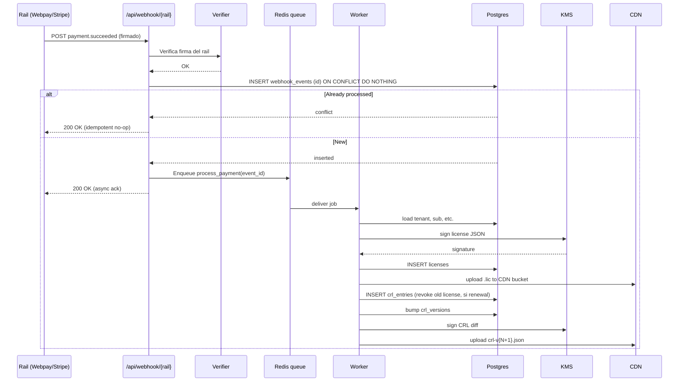

# Arquitectura de escalamiento

> **Cobertura**: cómo pharma-server (cliente on-prem) + pharma-license-server (SaaS) +
> pipeline de telemetría escalan de 0 a 100.000 instalaciones sin reescribir.

---

## 1. Targets de escala (12-24 meses)

| Componente | Target Q4-2026 | Target Q4-2027 | Justificación |
|---|---|---|---|
| Nodos pharma-server instalados | 1.000 | 25.000 | Adopción freemium |
| Licenses activas paid | 100 | 2.500 | 10% conversion |
| Activaciones nuevas/día | 30 | 300 | Crecimiento orgánico + marketing |
| Pagos exitosos/día | 5 | 100 | Sub + microtx |
| Webhooks de pago/día | 50 | 1.000 | Incluye reintentos |
| Eventos telemetría/día (opt-in) | 5M | 100M | 5k events/día/nodo activo opt-in (~20%) |
| CRL fetches/día | 5.000 | 250.000 | 1×/semana/nodo refresh_enabled |
| Reads CDN licenses + CRL/día | 50.000 | 2.5M | Re-fetch + nuevas |

---

## 2. Arquitectura objetivo

```mermaid
flowchart TB
  subgraph CDN[CDN edge global - Cloudflare/Fastly]
    LIC[licenses bucket inmutable]
    CRL[crl-vN.json firmado]
    STATIC[Web admin estático]
  end

  subgraph VERCEL[license-server Vercel - Multi-region edge]
    NEXT[Next.js App Router]
    API[/api/* - Edge Functions/]
    WH[/api/webhook/* - Node Functions/]
  end

  subgraph DATA[Capa de datos]
    PG[(Postgres primary)]
    PGR[(Postgres replica read-only)]
    REDIS[(Redis - idempotency cache)]
    KMS[KMS - Ed25519 private key]
  end

  subgraph PAY[Rails de pago]
    WP[Webpay Transbank]
    ST[Stripe]
    MP[Mercado Pago]
  end

  subgraph OBS[Observability]
    OTLP[OTLP collector]
    METRICS[Prometheus / Grafana Cloud]
    LOGS[Loki / Datadog]
    TRACES[Tempo / Honeycomb]
  end

  subgraph FLEET[pharma-server fleet - on-prem nodos]
    NODE1[nodo 1]
    NODE2[nodo 2]
    NODEN[nodo N...]
  end

  NEXT --> API
  API -->|read| PGR
  API -->|write| PG
  WH -->|verify+enqueue| REDIS
  WH --> PG
  WH --> KMS
  KMS -->|sign .lic| CDN
  PG -->|publish CRL diff| CDN

  WP --> WH
  ST --> WH
  MP --> WH

  FLEET -->|GET /licenses/{id}.lic| CDN
  FLEET -->|GET /crl-vN.json - opt-in| CDN
  FLEET -.->|opt-in telemetry| OTLP
  FLEET -->|payment redirect| PAY

  OTLP --> METRICS
  OTLP --> LOGS
  OTLP --> TRACES
```

---

## 3. License-server: principios

### 3.1 Stateless por diseño
- Next.js App Router en Vercel. Cada request es stateless.
- Session state: JWT firmado (no en memoria del server).
- Cache: Redis externo (Upstash o Vercel KV).
- Esto permite scale-to-zero + escalado horizontal automático sin sticky sessions.

### 3.2 Postgres como única fuente de verdad
- Schema (referencial, no implementación):
  ```sql
  CREATE TABLE tenants (id UUID PK, email TEXT, rut TEXT, created_at TIMESTAMPTZ);
  CREATE TABLE subscriptions (id UUID PK, tenant_id FK, tier TEXT, status TEXT,
                               current_period_end TIMESTAMPTZ, billing_cycle TEXT);
  CREATE TABLE licenses (id ULID PK, tenant_id FK, tier TEXT, features JSONB,
                          bought_addons JSONB, seat_count INT,
                          issued_at TIMESTAMPTZ, expires_at TIMESTAMPTZ,
                          key_id TEXT, signature TEXT, revoked_at TIMESTAMPTZ);
  CREATE TABLE payments (id UUID PK, tenant_id FK, rail TEXT, rail_event_id TEXT,
                          amount_clp INT, status TEXT, created_at TIMESTAMPTZ,
                          UNIQUE(rail, rail_event_id));     -- idempotency
  CREATE TABLE webhook_events (id UUID PK, rail TEXT, event_id TEXT, payload JSONB,
                                processed_at TIMESTAMPTZ,
                                UNIQUE(rail, event_id));    -- idempotency
  CREATE TABLE crl_entries (license_id ULID PK, revoked_at TIMESTAMPTZ, reason TEXT);
  CREATE TABLE crl_versions (version BIGINT PK, published_at TIMESTAMPTZ,
                              signature TEXT, entries_count INT);
  ```
- Read replicas para queries de lectura (license-server status, CRL builds).
- Connection pool (PgBouncer / Vercel native) para evitar exhaustion en serverless.

### 3.3 Idempotency global
- Toda operación de escritura lleva `Idempotency-Key` header.
- Tabla `webhook_events` con UNIQUE(rail, event_id) — segundo intento del mismo evento → no-op.
- Tabla `payments` UNIQUE(rail, rail_event_id) — doble cobro imposible aún con doble webhook.

### 3.4 Signer en KMS (private key separada de la app)
- Ed25519 private key en **AWS KMS / GCP KMS / HashiCorp Vault**.
- License-server llama a KMS para firmar, nunca tiene el secret en memoria.
- API KMS rate-limited y auditada.
- Backup de la key: backed up encrypted con MFA cuórum (2 de 3 fundadores en futuro).

---

## 4. CDN distribution para licenses y CRL

### 4.1 Por qué CDN
- License files son **inmutables** (firma vincula contenido). Cachear forever.
- CRL es **append-only versioned** — `crl-v{N}.json` también inmutable.
- 99% del tráfico de pharma-server hacia el license-server es lectura → 99% se sirve del
  edge sin tocar app.

### 4.2 Cache headers
```
GET /licenses/{license_id}.lic
  Cache-Control: public, max-age=31536000, immutable

GET /crl-v{N}.json
  Cache-Control: public, max-age=31536000, immutable

GET /crl-latest.json    (redirige al N+1 actual)
  Cache-Control: public, max-age=60       # único endpoint mutable, TTL corto
```

### 4.3 Invalidation
- License file inmutable: nunca se invalida. Si una license cambia, se emite license NUEVO
  con `license_id` distinto y el viejo va al CRL.
- CRL: nunca se invalida una versión publicada. Bumps `N → N+1`.
- `crl-latest.json`: TTL 60s + soft purge tras publish.

### 4.4 Multi-region delivery
- Cloudflare/Fastly tienen presencia LATAM (SCL, GRU, MIA). Latencia <50ms a CL.
- Origen del licenser puede vivir en us-east-1 sin afectar UX (CDN absorbe).

---

## 5. Webhook ingestion: design escalable



### 5.1 Reglas del diseño
- WH responde 200 **rápido** (target <500ms). Trabajo pesado al worker.
- DLQ (dead letter queue) tras 5 reintentos. Alerta humano.
- Worker es idempotente: re-procesar el mismo `event_id` no genera duplicados (UNIQUE en payments).
- Signing batched cuando posible (10 licenses al mismo tiempo en una llamada KMS firmada).

### 5.2 Throughput estimado
- KMS Ed25519 sign: ~1000 ops/s (depende del provider).
- Postgres writes: ~5k/s con connection pool sano.
- Queue (Redis Streams o Vercel KV queue): ~10k events/s.
- Bottleneck probable: KMS rate-limit. Mitigación: cliente del licenser cache la signature
  por idempotency key 5 min en Redis.

---

## 6. Telemetry pipeline (opt-in)

> Recordar invariante de `freemium-master-plan.md` §6.3: **opt-in siempre, default OFF,
> sin PII**.

### 6.1 Producer (en pharma-server nodo)
- `crates/telemetry` (ya existe). OTLP gRPC exporter, batched.
- Si `telemetry_enabled == true` en config:
  - Batch size 100 spans / 60s, whichever first.
  - Retry exponencial 3×, descarta si falla. **Nunca bloquea POS hot path**.
  - Compresión gzip.
  - Endpoint configurable: `PHARMA__OTLP__ENDPOINT` (defaults a `https://telemetry.pharma-server.cl:4317`).

### 6.2 Collector (cloud)
- OpenTelemetry Collector (HA, multi-region).
- Sampling at edge: 100% errors, 10% successes, configurable.
- Anonymización antes de exportar a backend:
  - `tenant_id` → SHA256(tenant_id || salt_mensual_rotativo).
  - Stripping de campos PII (email, RUT, nombres).
- Backends:
  - **Metrics**: Prometheus + Grafana Cloud (o self-hosted).
  - **Logs**: Loki o Datadog.
  - **Traces**: Tempo o Honeycomb.

### 6.3 Privacy and compliance
- Política de privacidad pública documenta qué se reporta.
- Endpoint `pharma telemetry status` muestra al usuario qué se reportó última hora.
- Endpoint `pharma telemetry purge` borra cache local pendiente de enviar.

### 6.4 Volumen y costo
- 5k events/día/nodo × 5k nodos opt-in = 25M events/día = ~10GB/día (compactos).
- Grafana Cloud o self-hosted barato (<USD 200/mes en este volumen).
- Scaling vertical: cuando >50GB/día, mover a tier ingestion dedicado.

---

## 7. Multi-region readiness

| Componente | Multi-region desde día 1 | Cómo |
|---|---|---|
| CDN (licenses + CRL) | ✅ | Cloudflare/Fastly edge global |
| License-server API | ✅ | Vercel Edge Functions / fluid compute |
| Postgres primary | ❌ (single region us-east-1) | Réplicas read-only en otras regiones |
| KMS signer | ✅ (provider multi-AZ) | AWS KMS multi-region keys cuando necesario |
| Webhook ingestion | ✅ | Edge function termina cerca del rail |
| Telemetry collector | ✅ | OTel collector federado |

Trade-off: para CL específicamente, la latencia de Vercel us-east-1 → CL es ~140ms. Para
checkout y activation es invisible. Para webhooks de Webpay (origen CL) es ~150ms ida y
vuelta, todavía <500ms target.

Si crece >100k tenants en CL: considerar Postgres read replica en sa-east-1 (São Paulo) y
Edge function geo-routing.

---

## 8. Observability — SLO targets

### 8.1 License-server (SaaS)
| SLO | Target | Window |
|---|---|---|
| `/api/checkout/*` availability | 99.9% | 30d |
| `/api/webhook/*` ingestion success | 99.95% | 30d (incluye reintentos) |
| `GET /licenses/*` latency p99 | <100ms (vía CDN) | 7d |
| License emission latency (paid → .lic disponible) | p95 <30s | 7d |

### 8.2 pharma-server (cliente, OPT-IN telemetry)
| SLO | Target |
|---|---|
| POS endpoint p99 latency | <50ms |
| `/health/ready` | <10ms |
| Startup time (cold) | <3s |
| Crash rate | <0.5%/sesión |

### 8.3 Métricas tracked
- **Producto**: DAU, MAU, conversion rate, churn, MRR, NRR.
- **Salud**: error rate, latency percentiles, retry counts, queue depth.
- **Costo**: KMS calls, CDN bandwidth, Postgres rows, telemetry ingestion.

---

## 9. Fleet management (Enterprise tier)

Capability: cliente Enterprise tiene **múltiples MSIs** desplegados (e.g. 50 sucursales).
Necesita visibilidad central.

### 9.1 Diseño v1 (Fase 14)
- Cada nodo Enterprise opta-in a heartbeat firmado al `pharma-license-server`:
  - `POST /fleet/heartbeat` cada hora con: nodo DID, version, health summary.
- Web admin Enterprise muestra: lista de nodos, status, version, last-seen.
- Sin RPC remoto (no permitimos comandos remotos sin autorización on-site explícita).

### 9.2 Diseño v2 (futuro)
- Push de updates coordinados (release N+1 staged a 10%, 25%, 100% de la fleet).
- Roll-back coordinado si crash rate spike.
- Sólo Enterprise tier.

---

## 10. Cost model (orden de magnitud)

> **No precios reales** — referencias para sizing. Actualizar con cotizaciones cerradas.

| Servicio | Tier inicial | USD/mes inicial | A escala (Q4-2027) |
|---|---|---|---|
| Vercel (license-server) | Pro | 20 | 250 |
| Postgres (Neon / Supabase) | Free → Pro | 0 → 25 | 200 |
| Redis (Upstash) | Free → Pro | 0 → 10 | 50 |
| KMS (AWS) | Pay-per-use | 5 | 50 |
| CDN (Cloudflare) | Free → Pro | 0 → 20 | 100 |
| Grafana Cloud | Free → Pro | 0 → 50 | 250 |
| DTE provider (SimpleAPI) | Free hasta 200/mes | 0 | 100 |
| Pago rails (fees variables) | 2.95-3.5% | variable | variable |
| **Total fixed monthly** | | **~$50** | **~$1,000** |

Margen: Pro tier @ CLP $14.900 (USD ~16) × 100 clientes = USD 1600/mes contra USD 50 de
costos fijos = margen 97% Q4-2026. Sano.

---

## 11. Disaster recovery

| Escenario | RTO | RPO | Procedimiento |
|---|---|---|---|
| Postgres primary cae | 5 min | <1 min | Failover automatic a replica (Neon/Supabase) |
| Vercel región caída | 0 (otra región) | 0 | Edge functions multi-region |
| CDN caído | 30 min | 0 | Failover a origen directo (más lento, igualmente válido) |
| KMS signer comprometido | Inmediato | N/A | Procedimiento ADR-0007 §6 (key rotation emergencia) |
| Postgres data loss catastrófico | 1 hora | <15 min | Restore from PITR snapshot |
| `pharma-server` MSI con bug grave | N/A | N/A | Release nuevo + sin kill-switch, comunicación email + status page |

---

## 12. Referencias

- [ADR-0004 — License-server separado](../adr/0004-license-server-separado.md)
- [ADR-0006 — Revocation CRL signed](../adr/0006-revocation-strategy-signed-crl.md)
- [ADR-0007 — Key rotation licenser](../adr/0007-key-rotation-licenser.md)
- [`license-architecture.md`](./license-architecture.md)
- [`payments-cl.md`](./payments-cl.md)
- [`freemium-master-plan.md`](./freemium-master-plan.md)
- OpenTelemetry: https://opentelemetry.io/docs/
- 12-factor app: https://12factor.net/
